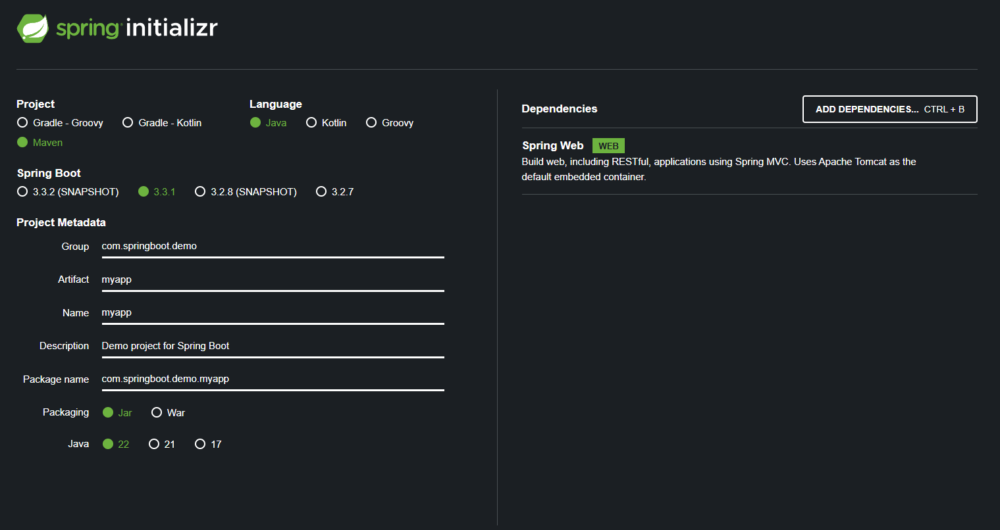

Spring Initializr is a web application that you can use to generate a Spring Boot project. All you need to do is select the necessary configuration such as -

1. Gradle or Maven
2. Java or Kotlin or Groovy
3. Spring Boot Version
4. Project Metadata
5. Dependencies

Once you generate the project, all you need to do is import the project into your IDE of choice.

# QUICK WORD ON MAVEN

When we build our Java project, we may need additional JAR files for example "Spring", "Hibernate", "Common Logging", "JSON", etc.

One approach is to download the JAR files from each project website and then manually add then to your build path / classpath.

However, Maven provides a nice solution where you just tell Maven the projects that you are working with (dependencies) for example Spring, Hibernate etc.

And then, Maven will go out and download the JAR files for those projects for you. Maven will automatically make those JAR files available during compile / run.

# DEVELOPMENT PROCESS

1. Configure our project at Spring Initializr website.
2. Download the zip file
3. Unzip the file
4. Import the project into the IDE

So, as in the image above, we configured the project at the Spring Initializr website. Once we are done, we can click on the Generate button which will give us a zip file.

You just need to extract the zip file which will give you a folder.

Now, all you need to do is import this folder into the IDE.

Quick tip -> To import the project in IntelliJ, simply choose the pom.xml file and IntelliJ will automatically tell you that this is part of a project so do you want to open the Project or just this file. At that time, select "Open project" option. This way, all the dependencies and other stuff will automatically be analyzed and downloaded by IntelliJ.

Finally, to run the Spring Boot application, simply go to the main folder inside src where you will find the .java file that has a "public static void main" method. This is the file we need to run as this is the entry point of any Spring Boot application. You can right click the file name on the left side and select Run.

And if everything is right, you will see in the console that it says - 

    Tomcat started on port 8080 (http) with context path '/'
    Started MyappApplication in 2.64 seconds (process running for 3.147)

This means our application has started successfully.

Does it mean we can do to localhost:8080 and it will display something on the screen? Well, at this point, NO! It will instead show - 

    Whitelabel Error Page
    This application has no explicit mapping for /error, so you are seeing this as a fallback.

This is expected because we have not added any code to our app yet that will handle requests to different URLs. So at the moment, Spring Boot does not know what to give back when we go to localhost:8080.

And well, that's how we can get started with a Spring Boot application.