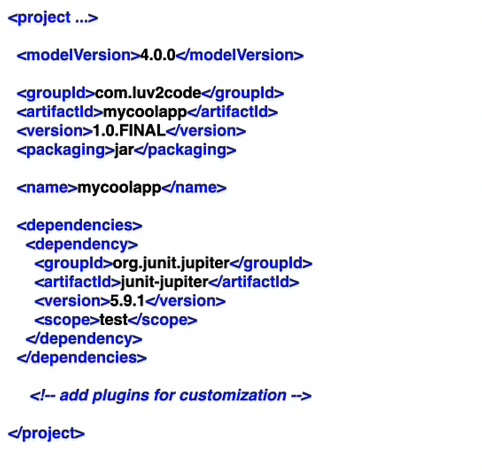

Let's first discuss the pom.xml file.

POM stands for "Project Object Model" and this is the configuration file for our project. In this file, we tell maven on what dependencies we depend on. This file will always be located in the root of the Maven project.

The pom.xml file provides a declarative way to describe a project's configuration and dependencies, which makes it easier to manage and maintain the project. By using a pom.xml file, Maven can automatically download and manage dependencies, compile and package the project, and generate documentation.

# STRUCTURE OF A POM FILE

The pom.xml file can be divided into three parts - 

    1. Project metadata
    2. Dependencies
    3. Plugins

The Project metadata means things such as the Project name, the version, output file type (JAR, WAR) and so on.

The Dependencies section has a list of projects that we depend on like Spring, Hibernate and so on.

Finally, the plugins section has additional custom tasks to run. For example, generate JUnit Test reports etc.

# A SIMPLE POM FILE

The image above shows a simple pom.xml file.

The "modelVersion" is the version of the Maven POM model that is used by the project. It is always set to 4.0.0 in Maven 2 and 3.

Then, we have the Project Metadata that includes these elements - 

    1. groupId: It specifies the group of the organization that owns the project. The convention is to use the reverse domain name. For example, "com.google"
    2. artifactId: It is a unique identifier for the project.
    3. version: This is the version of the project
    4. packaging: The type of artifact generated by the project. Such as JAR or WAR.
    5. name: The name of the Maven project

Next, we have the dependencies section where a list of dependencies that are required by the Project are listed.

You will see that for each dependency, we have similar elements to define them for example, groupId, artifactId, version (optional) etc. These are also called "GAV" or "Group ID, Artifact ID, and Version".

The "scope" element defines the scope for this maven project. It can be "compile", "provided", "runtime", "test" and "system". This scope is used to limit the transitivity of a dependency, and also to affect the classpath used for various build tasks.

As in the image above, the "scope" is "test" which means the dependency is not required for the normal use of application, and it is only needed for the test compilation and test execution.

If the scope was "compile", it would mean that the compiled dependencies are available in all classpaths of the project. Furthermore, those dependencies are propagated to dependent projects. This is also the default scope if you do not provide anything explicitly. The classpath is available for both "src/main" and "src/test"

The scope of "runtime" indicates that the dependency is not required for compilation but for execution. It is in the runtime and test classpaths but not in compile classpath.

The scope of "provided" is similar to "compile" but this means that you expect the JDK or a container to provide the dependency at runtime.

Finally, the "system" scope is similar to "provided", except that you have to provide the JAR explicitly which contains the dependency. The artifact is always available and is not looked up in a repository.

After the dependencies section, we have the section to add Plugins. Now, both the dependencies and plugins are JAR files. But, the difference is that, most of the work in Maven is done using plugins, whereas dependency is just a JAR file that will be added to the classpath while executing the tasks.

For example, you use a compiler-plugin to compile the java files. You can't use compiler-plugin as a dependency since that will only add the plugin to the classpath, and will not trigger any compilation. The Jar files to be added to the classpath while compiling the file, will be specified as a dependency.

So, the bottom line is that - 

    Plugins perform tasks for a Maven build. These are not packaged in the application.

    Dependencies are Maven artifacts/components required for the project.

