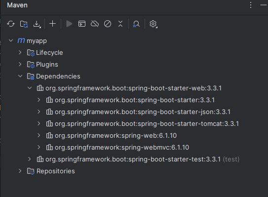

Building a Spring application is really hard.

One of most frequently asked questions is "Which Maven dependencies do I need?".

If would be great if there was a simple list of Maven dependencies, collected as a group of dependencies so that we do not have to search for each dependency.

The solution is "Spring Boot Starters".

These are collection of dependencies grouped together, tested and verified by the Spring Development team. And these starters make it much easier for the developer to get started with Spring.

There are around 50+ Spring Boot Starters for different Spring and related technologies. These starters give all the dependencies under a single name.

For example, if you want to use Spring Data JPA for database access, you can include spring-boot-starter-data-jpa dependency.

# EXAMPLE

Let's take an example of Spring MVC. When building a Spring MVC application, you normally need - 

    Spring MVC
    Hibernate Validator
    Template Engine (for example, Thymeleaf)
    ... and so on

But, an even better and easier way is to just add one single starter named "spring-boot-starter-web" to the dependencies section in pom.xml file. This one dependency entry contains other entries such as "spring-web", "spring-webmvc", "json", "tomcat", "hibernate-validator" and so on.

This really saves the developer from having to list all of the individual dependencies and also makes sure you have compatible versions.

# SOME COMMON SPRING BOOT STARTERS

1. spring-boot-starter-web: It is used for building the web applications, including RESTful applications using Spring MVC. It uses Tomcat as the default embedded container.
2. spring-boot-starter-test: It is used to test Spring Boot applications with libraries, including JUnit, Hamcrest, and Mockito.
3. spring-boot-starter-data-jpa: Starter for using Spring Data JPA with Hibernate
4. spring-boot-starter: Core starter, including auto-configuration support, logging, and YAML.
5. spring-boot-starter-aop: Starter for aspect-oriented programming with Spring AOP and AspectJ
6. spring-boot-starter-security: Starter for using Spring Security

# WHAT'S IN THE STARTER?

Most IDE's have a Dependency Management / View feature so you can see what all dependencies are there in a particular starter.

For IntelliJ, you can go to View -> Tool Windows -> Maven -> Dependencies.

You can then expand any starter dependency and see what all dependencies are present inside it. And you will see that starters can have other starters inside them and so on.

# SPRING BOOT STARTER PARENT

There is something called a "Starter Parent" that Spring Boot provides and this is a special starter that provides some default to quickly build our Spring project.

    <parent>
		<groupId>org.springframework.boot</groupId>
		<artifactId>spring-boot-starter-parent</artifactId>
		<version>3.3.1</version>
		<relativePath/>
	</parent>

Maven Defaults that are defined in the Starter Parent include - 

    1. Default compiler level
    2. UTF-8 source encoding
    3. Others...

When we use a Starter Parent, we do not need to define versions of the spring-boot-starter-* dependencies as Maven will download JAR files based on the version defined for the starter parent.

To manage a different version of a dependency provided by the starter parent, we can declare the dependency and its version explicitly in the "dependencyManagement" section.

    <dependencyManagement>
        <dependencies>
            <dependency>
                <groupId>org.springframework.boot</groupId>
                <artifactId>spring-boot-starter-data-jpa</artifactId>
                <version>3.1.5</version>
            </dependency>
        </dependencies>
    </dependencyManagement>

# OVERRIDING DEFAULTS

What if we do not want to use some default value that Starter Parent has?

For that, we can re-declare those properties in the <properties> section.

    <properties>
        <java.version>17</java.version>
    </properties>