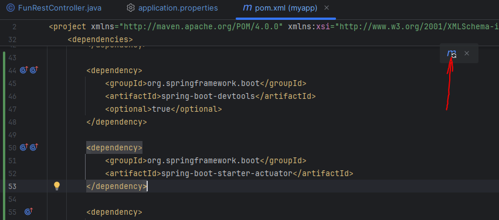

# THE PROBLEM

When we run Spring Boot applications, if we make some change to the code, we have to manually restart our application. This is not a good developer experience.

# THE SOLUTION

We can use "spring-boot-devtools". 

The "spring-boot-devtools" module can be included in any project to provide additional development-time features.

When the code is updated, this will automatically restart your application. All we need to do is add the dependency to our POM File. There is no need to write any additional code.

    <dependency>
        <groupId>org.springframework.boot</groupId>
        <artifactId>spring-boot-devtools</artifactId>
    </dependency>

Note that once you add a dependency, you can to click on the "Load Maven Changes" button so that these new dependencies are added to the project - 

For IntelliJ Community Edition, we will have to do some additional configurations, though.

# ADDITIONAL CONFIGURATION FOR INTELLIJ COMMUNITY EDITION

The IntelliJ IDE (Community Edition) does not support Spring Boot Devtools by default.

First, we need to go to the Settings (CTRL + Alt + S), then select the "Build, Execution, Deployment", then select "Compiler", and then check the box which says "Build project automatically".

Next, we need to go to Settings (CTRL + Alt + S), then select "Advanced Settings", and then check the option called "Allow auto-make to start even if developed application is currently running".

And that's all we need to do to make the Spring Boot Devtools work with the IntelliJ Community Edition.