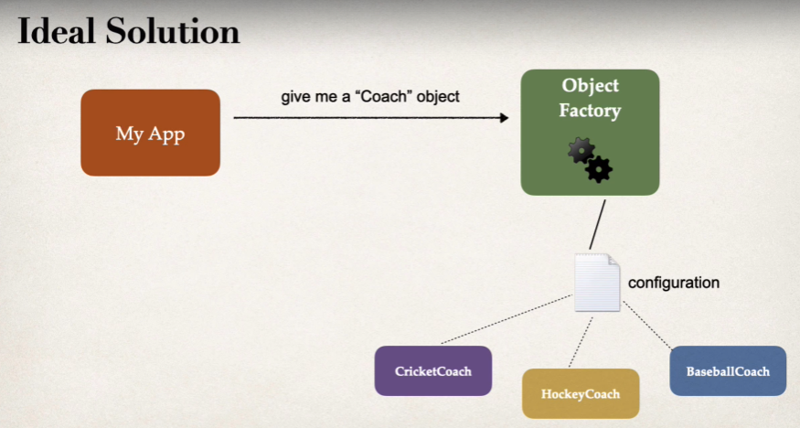

Inversion of Control is a principle in software engineering which transfers the control of objects or portions of a program to a container or framework. We most often use it in the context of object-oriented programming.

In simpler words, it is an approach of outsourcing the creation and management of objects. So, instead of us manually creating the objects, we will outsource it to a container or a framework.\

The advantages of this architecture are:

 - decoupling the execution of a task from its implementation
 - making it easier to switch between different implementations
 - greater modularity of a program
 - greater ease in testing a program by isolating a component or mocking its dependencies, and allowing components to communicate through contracts

# CODING SCENARIO

Let's say that we have an app and a "CricketCoach" on which we would like to call a method named "getDailyWorkout()" which will give us the daily workout routine for cricket.

Now, we want this app to be configurable so we should be able to easily change the coach for some other sport like Baseball, Hocket, Tennis, etc.

As the image above shows, the Ideal solution here would be to ask an "Object Factory" for the "Coach" object so that it is the task of this "Object Factory" to decide based on a configuration which coach object to give.

Just for information, ab ObjectFactory is responsible for creating objects of a specific type.

And in case of "Spring" framework, the "Spring IOC Container" works as the "Object Factory" so, we will tell Spring what we need and Spring will give us that object's reference.

# SPRING IOC CONTAINER

So, what is this "Spring IOC Container"?

The Spring IOC Container is at the core of the Spring Framework. The container will create the objects, wire them together, configure them, and manage their complete life cycle from creation till destruction.

In the Spring framework, the interface "ApplicationContext" represents the IoC container.

We generally call the objects managed by Spring IOC Container as "beans".

The primary functions are of Spring IOC Container are -

    1. Create and manage objects (Inversion of Control)
    2. Inject object dependencies (Dependency Injection)
   
# CONFIGURING THE SPRING IOC CONTAINER

There are primarily three different approaches to configure the Spring IOC Container - 

    1. XML Configuration File (Legacy)
    2. Java Annotations (Modern)
    3. Java Source Code (Modern)