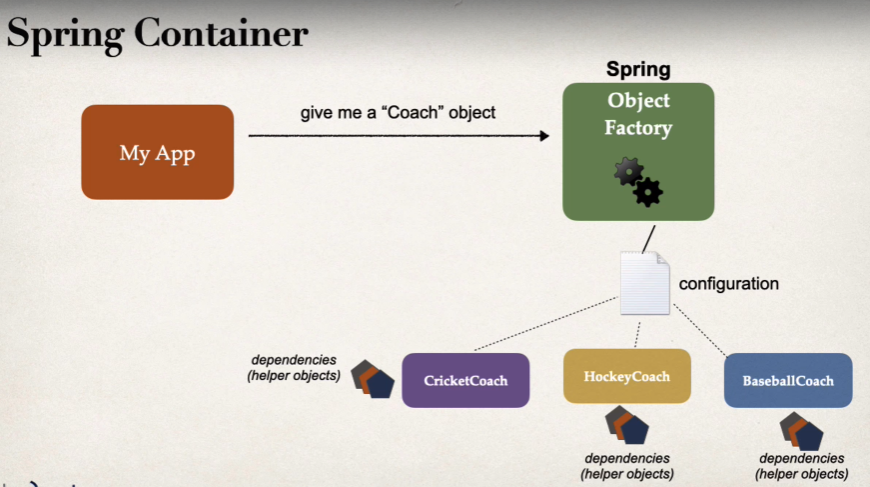

Dependency Injection makes use of the "Dependency Inversion" principle. In this, the client delegates to another object, the responsibility of providing its dependencies.

Dependency Injection is a pattern we can use to implement Inversion of Control, where the control that is being inverted is setting an object's dependencies.

Connecting objects with other objects, or “injecting” objects into other objects, is done by an assembler rather than by the objects themselves.

So, if we take the same example as we did in last section, we can say that if our different Coach objects have dependencies, then it is the job of the Spring IOC Container to assemble all of those dependencies and then give us the object back.

Let's say we have a Controller class that wants to use the "Coach" object. Now, we can say that "Coach" is a dependency of the "Controller" and so, we will have to "inject" this dependency into the Controller. Ofcourse we won't do that ourselves.

# TYPES OF INJECTION

The two recommended Injection types are - 

    1. Constructor Injection
    2. Setter Injection

Which one to use?

Generally, it is recommended that if you have "required" dependencies, then use "Constructor Injection". It is recommended by Spring as the first choice.

If we have optional dependencies, we can use "Setter Injection". Because in this case, if the dependencies are not provided, our app can still have some default behavior. That's why the dependencies are optional in the first place.

# AUTOWIRING

Spring uses a technique called "Autowiring" for dependency injection.

So, Spring will look for a class that matches the class or interface and then it will inject it automatically. Internally, it uses setter or constructor injection.

Let's go back to our "Coach" example. So, Spring will look for all the classes that are annotated with "@Component" annotation and then see if anyone implements the "Coach" interface. If it founds one, then it will inject it. For example, "CricketCoach".