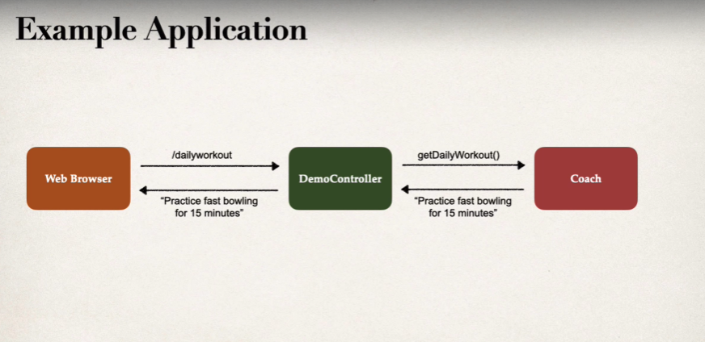

Let's try to code what we have learned so far.

Suppose, we want to have a simple Spring application that, when a request is made to /dailyworkout, returns a workout that it gets from the "Coach".

Let's start with "Constructor Injection" first.

First, let's define an interface "Coach" that just has one method in it.

    public interface Coach {
        String getDailyWorkout();
    }

Now, we want to have a class "CricketCoach" that implements this interface and overrides the method.

    public class CricketCoach implements Coach{
        @Override
        public String getDailyWorkout() {
            return "Practice fast bowling for 15 minutes";
        }
    }

At this point, we have not told Spring to manage the objects of this class whenever we need them. We have to add the @Component annotation to this class for that.

    @Component
    public class CricketCoach implements Coach{
        @Override
        public String getDailyWorkout() {
            return "Practice fast bowling for 15 minutes";
        }
    }

And now, whenever we need an object of this class, we just have to ask Spring for that and it will give us.

Let's define a Rest Controller where we will use this class' object as a dependency.

    @RestController
    public class DemoController {

        private Coach coach;

        @Autowired
        public DemoController(Coach coach) {
            this.coach = coach;
        }

        @GetMapping("/dailyworkout")
        String getWorkout() {
            return coach.getDailyWorkout();
        }
    }

Note that we used the "@Autowired" annotation on the constructor. Spring will call the constructor to instantiate the "DemoController" class and it will automatically look and provide the dependency for the "Coach" object.

Note that if we have only one constructor, then it is optional to use "@Autowired" on it.

It will scan all the classes in our project that have the @Component annotation and see which one implements the "Coach" interface. As it finds one, it injects its object into the DemoController class which we can then use.

# WHY CONSTRUCTOR INJECTION IS THE RECOMMENDED APPROACH?

If you dig around a bit, you will find that there is a type of injection named "Field Injection". It is really simply and requires less lines of code. For example, in case of above code, instead of defining a constructor, we can simply do -

    @RestController
    public class DemoController {

        @Autowired
        private Coach coach;

        @GetMapping("/dailyworkout")
        String getWorkout() {
            return coach.getDailyWorkout();
        }
    }

Looks way better right?

Well, there is an issue. We are violating the very nature of Java using this appraoch. Note that "coach" is private which basically means we cannot access it from outside. Still, Spring can access it using the "Reflection APIs". This is not how Java is inteded to work.

And this is why it is recommended to use Constructor Injection, even though you have to write a bit more code.

One advantage of Constructor Injection is that you can actually make your variables "final" since we know that in above code the "coach" object will not change once it is initialized.

    @RestController
    public class DemoController {

        private final Coach coach; <- MAKING IT FINAL

        @Autowired
        public DemoController(Coach coach) {
            this.coach = coach;
        }

        @GetMapping("/dailyworkout")
        String getWorkout() {
            return coach.getDailyWorkout();
        }
    }

This is something you cannot do in case of Field Injection as the IDE will throw an error saying  "Variable 'coach' might not have been initialized".

And the reason why for required dependencies, we should use Constructor Injection is that - If you want to instantiate a class you always do it with its constructor. So if you are using constructor based injection, the only way to instantiate the class is through that constructor. If you pass the dependency through constructor, it becomes evident that it is a mandatory dependency.

# BEHIND THE SCENES

This is what Spring Container does behind the scenes.

Since we told Spring that we need an instance of the "Coach" in our "DemoController", Spring framework will do something like this - 

    Coach theCoach = new CricketCoach();
    DemoController demoController = new DemoController(theCoach); 

So, behind the scenes, Spring creates a new instance of the "CricketCoach" and then performs Constructor Injection with the DemoController class to inject this instance in the DemoController.

You may think that, why do we even need Spring to do this because all we are doing is using the "new" keyword to get a new instance. That's pretty much it.

The thing is, Spring is more than just Inversion of Control and Dependency Injection. For small basic apps, it may be hard to see the actual benefits of Spring.

Spring is actually designed for Enterprise applications. It provides features like Database acess and transactions, REST APIs, Security and much more.

In case of Dependency Injection, it is important to understand that "Autowiring is not required, just convenient.".
