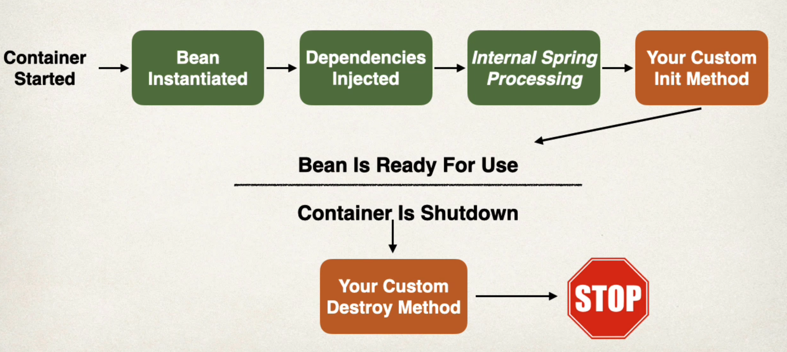

The above image shows an overview of the Bean Lifecycle.

The lifecycle of any object means when & how it is born, how it behaves throughout its life, and when & how it dies. Similarly, the bean life cycle refers to when & how the bean is instantiated, what action it performs until it lives, and when & how it is destroyed. 

The lifecycle of a bean is managed by the Spring container.

So first, the "Container" gets started.

After that, the "Bean" instance is created as per the request and the dependencies are then injected. At this point, the bean is ready to use.

And finally the bean is destroyed when the container is closed.

Now, between the creation of a bean instance and destruction, if we want to execute some code, then we can use the custom initialization and destruction methods.

# BEAN LIFECYCLE METHODS

These are the methods that we can use to add code during bean initialization and destruction. 

We can add custom code during bean initialization to do things like calling custom business logic methods, and setting up handles to resources (db, sockets, file etc).

We can add custom code during bean destruction to do things like calling custom business logic methods, and cleaning up the handles to resources (db, sockets, file etc).

It is important to note that these lifecycle methods can have any name. It is not necessary to have names as "init()" or "destroy()". 

# RUNNING CUSTOM CODE ON BEAN INITIALIZATION & DESTRUCTION

We can use an annotation "@PostConstruct" on any method in our Bean class that we want to be called at the time of Bean Initialization.

For example, in our 'CricketCoach' class, let's add a new method that should be called when the bean is created.

    @PostConstruct
    public void init() {
        System.out.println("In init method: " + getClass().getSimpleName());
    }

Similarly, if we want to run a custom code when the bean is destroyed, we can use an annotation "@PreDestroy".

    @PreDestroy
    public void destroy() {
        System.out.println("In destroy method: " + getClass().getSimpleName());
    }

Now, if you run the application, you will see that as soon as we visit any route like /dailyworkout or /check, the terminal will print - 

    In init method: CricketCoach

And the reason why we had to visit a route for the bean to be initialized is because we are using lazy initialization in our code at this point.

# WHY WAS THE DESTROY METHOD NOT CALLED?

If we stop our application, the console should say -

    In destroy method: CricketCoach

But wait, it does not show this line. Why?

Well, remember that last time, we had changed the scope of "CricketCoach" to "prototype".

And there is one point you need to be aware of with "prototype" scoped beans. For such beans, Spring does not call the "destroy" method.

The reason is that, in case of "prototype" beans, Spring does not manage the entire lifecycle. The container simply instantiates and configures the bean and then hands it over to the client with no further record of that prototype instance.

Thus, although initialization lifecycle callback methods are called on all objects regardless of scope, in the case of prototypes, configured destruction lifecycle callbacks are not called. The client code must clean up prototype-scoped objects and release expensive resources that the prototype bean(s) are holding.