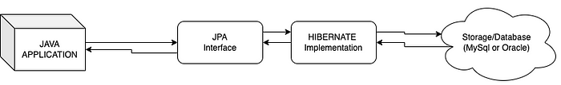
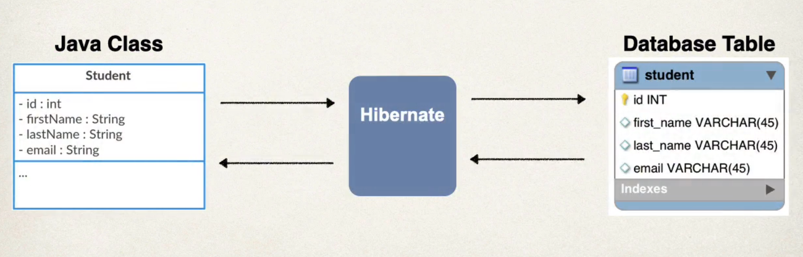

JPA stands for "Jakarta Persistence API" (previously known as Java Persistence API) and as the name suggests, this is an API so it provides some specifications for persisting, reading, and managing the data between the Java Objects and Relational Databases.

Hibernate is one of the most popular "implementations" of JPA. It helps to map Java objects to database tables. What Hibernate does under the hood, is to translate Java codes into SQL queries that the DBMS (Database Management System) can understand.

So, now, it is easy to understand that "JPA" in itself is just a guideline to follow to manipulate the database. And "Hibernate" is an implementation of this guideline.

For example, in Java, we have interfaces and then those are implemented by different classes. Similarly, JPA can be called the interface and Hibernate is the implementation of this interface.

# BENEFITS OF HIBERNATE

    - Handles all of the low-level SQL.
    - Minimized the amount of JDBC code you have to develop.
    - Provides the Object Relational Mapping (ORM)
    - Hibernate has capability to generate primary keys automatically while we are storing the records into database.
    - Hibernate has its own query language, i.e hibernate query language, which is database independent.

# OBJECT RELATIONAL MAPPING (ORM)

So, what is this ORM?

It is an approach of taking an object-oriented data and mapping it to a relational data store (e.g. tables in an RDBMS).

When talking about ORM, most people are referring to a library that implements the Object-Relational Mapping technique, hence the phrase "an ORM". Hibernate is an ORM library.

# SAVING A JAVA OBJECT WITH JPA

Let's see a small piece of code and see how a java object is saved in a database.

    Student theStudent = new Student("Paul", "Doe", "paul@google.com");

    entityManager.persist(theStudent);

Here, we first create a Java object and then we use the "EntityManager" which is a special JPA helper object to insert this object in a database as a row. 

So under the hood, the data will be stored in the database using the SQL Insert query.

In the old days of JDBC, you would have to manually write the SQL code but here, all the work is being done by Hibernate/JPA.

# RETRIEVING A JAVA OBJECT WITH JAVA

Once the object is saved to the database, we can retrieve it from the database using the primary key. Since we have not explicitly provided any unique ID for the object above, it will automatically be assigned a unique id in the table.

So, we can then retrieve it using this id.

    int theId = 1;
    Student myStudent = entityManager.find(Student.class, theId);

So here, we again use the JPA Helper Object "EntityManager" to find the row that has a particular id and then it will convert the data in that row into a Student object and then return that object back.

This is just one of the different ways to retrieve data from the database using JPA/Hibernate.