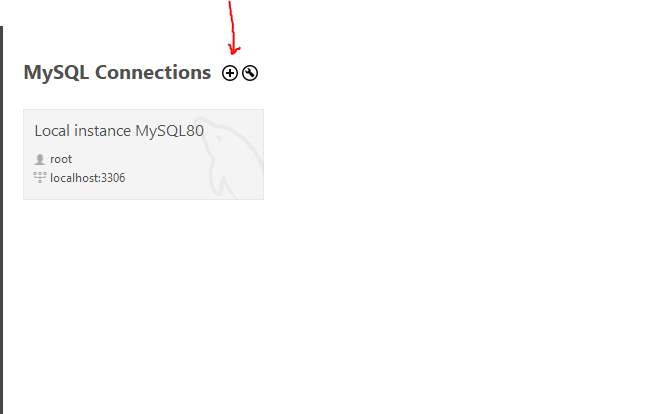
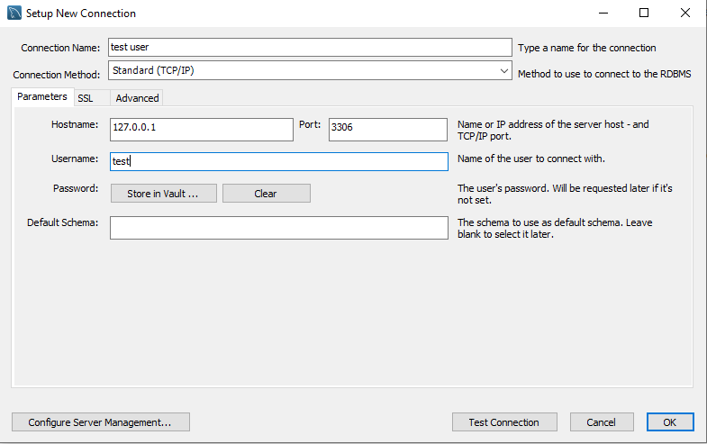
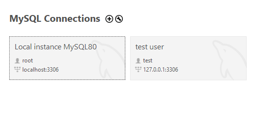
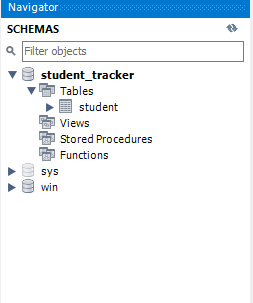

We will use a MySQL Database in our project. 

There are two components that the MySQL system includes

    1. MySQL Database Server
    2. MySQL Workbench

The MySQL Database Server is the main engine of the database and this is where we store the data for the database. It supporst CRUD features on the data. CRUD stands for "Create Read Update and Delete".

The MySQL Workbench is a client GUI for interacting with the database. We can create database schemas and tales, execute SQL queries to retrieve data, perform insert, update and deletes on the data, and handle administrative functions such as creating users. 

# INSTALLING THE MYSQL SOFTWARE

The first step is to install the MySQL Development Server. You can download it from this page -> https://dev.mysql.com/downloads/mysql/

Then, download the MySQL Workbench from this page -> https://dev.mysql.com/downloads/workbench/

# SETTING UP DATABASE TABLES

In the "Scripts" folder, you will find two database scripts. First is to create a new user with username as "test" and password as "test" (You can change it if you want).

    -- Drop user first if they exist
    DROP USER if exists 'test'@'%' ;

    -- Now create user with prop privileges
    CREATE USER 'test'@'%' IDENTIFIED BY 'test';

    GRANT ALL PRIVILEGES ON * . * TO 'test'@'%';

The second script is to create a new database named "student_tracker" and in that databse, create a new table named "student".

    CREATE DATABASE  IF NOT EXISTS `student_tracker`;
    USE `student_tracker`;

    --
    -- Table structure for table `student`
    --

    DROP TABLE IF EXISTS `student`;

    CREATE TABLE `student` (
    `id` int NOT NULL AUTO_INCREMENT,
    `first_name`varchar(45) DEFAULT NULL,
    `last_name` varchar(45) DEFAULT NULL,
    `email` varchar(45) DEFAULT NULL,
    PRIMARY KEY (`id`)
    ) ENGINE=InnoDB AUTO_INCREMENT=1 DEFAULT CHARSET=latin1;

So, open the MySQL Workbench, and inside that, run the first script and once that's done, close the current connection because we now want to create a new connection for this new user that we have created.

Click on the plus symbol.

Give any name for the connection and enter the username as "test".

Then when you click on test connection, it will as you for the password. Enter the password that you have given in that first script (default is "test"). 

If connection is successful, click on ok and this new connection will be added.

And now, we will use this new connection. 

Open it and then in that, open and run the second script. Once you run the script, you will then see the database and the table on the left side if you refresh the schemas section.