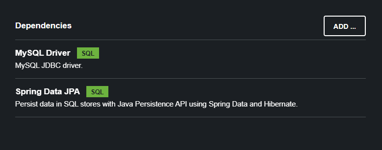

Based on the configuration, Spring Boot will automatically create the beans - "DataSource", "EntityManager" and more.

And then, we can inject these beans in our app.

As the above image shows, "MySQL Driver" and "Spring Data JPA" are the two dependencies we will add in our project when we generate it from Spring Initializr.

Based on the entries in Maven POM file, Spring Boot will automatically configure the data source for you.

Spring Boot will read the database connection details from the application.properties file.

# APPLICATION PROPERTIES FILE

We can specify the url for the database, the username and the password in the application.properties file - 

    spring.datasource.url=jdbc:mysql://localhost:3306/student_tracker
    spring.datasource.username=test
    spring.datasource.password=test

There is no need to give the JDBC Driver class name because Spring Boot will automatically detect it from the url.

# COMMAND-LINE APP

Now, notice that we have not added any Spring Rest dependency which means our app will just be a simple command line app. 

Our main class that is annotated with @SpringBootApplication has to implement the "CommandLineRunner" interface so that we can implement a method named "run" which will be called when all the beans have been loaded.

    @SpringBootApplication
    public class CruddemoApplication implements CommandLineRunner {

        public static void main(String[] args) {
            SpringApplication.run(CruddemoApplication.class, args);
        }

        @Override
        public void run(String... args) throws Exception {
            System.out.println("Hello World!");
        }
    }

Now, if we run the application, the terminal should print "Hello World!".

But wait, we get an error - 

    Failed to configure a DataSource: 'url' attribute is not specified and no embedded datasource could be configured.

This error occured because we have not configured the datasource, even though we have added the MySQL Driver dependency. This is important otherwise the app will not work.

# ADDING CONNECTION DETAILS

We have to provide the database url, the username and password.

    spring.datasource.url=jdbc:mysql://localhost:3306/student_tracker
    spring.datasource.username=test
    spring.datasource.password=test

And once we do that, we can now run the application without any issues and it should show "Hello World!" in the terminal which means all the beans have been loaded successfully.

It will show show this - 

    HikariPool-1 - Added connection com.mysql.cj.jdbc.ConnectionImpl@65e21ce3
    HikariPool-1 - Start completed.

This means the database connection was successful. But, how to verify that it is indeed connecting to the database? Maybe let's try to give a wrong password in the application.properties file and see if the application starts.

Well, if we do that, our application will fail to start and errors will be shown in the terminal. So it means the Spring Boot app is indeed connecting to the real database if we provide the correct password.

# CLEANING THE TERMINAL

By default, Spring Boot shows a ton of details on the termial which we may not want to see all the time. So, we can actually reduce the amount of text we see in the terminal.

For example, if you do not want to see that large Spring banner, we can add this line to the application.properties file - 

    spring.main.banner-mode=off

Let's also minimize the amount of logs that we see in the terminal. We only want to see warning and errors in the console.

    logging.level.root=warn

And now our terminal will be looking much better.