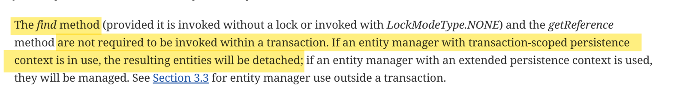

The last piece of the puzzle is the "Delete" operation.

The steps to delete an object are the same as updating an object, except for the last part.

So, we first have to get hold of the object and then call the "remove" method on that object using the Entity Manager.

    // Retrieve the student
    int id = 1;
    Student student = entityManager.find(Student.class, id);

    // Delete the student
    entityManager.remove(student);

And similarly, we can also delete multiple rows from the database using the "createQuery" method, paired with "executeUpdate()" method.

    entityManager.createQuery("DELETE FROM Student WHERE lastName='Smith'").executeUpdate();

Note that there is no such method as "executeDelete". The method named "executeUpdate" is simply generic term because in case of delete too, we are modifying the database table.

## STEP 1 - ADD A NEW METHOD TO THE DAO INTERFACE

As always, let's add a new "delete" method to our DAO interface and this method will accept the id of the student to delete.

    public interface StudentDAO {
        void save(Student student);
        Student findById(Integer id);
        List<Student> findAll();
        List<Student> findByLastName(String lastName);
        void update(Student student);
        void delete(Integer id); <- THIS ONE
    }

## STEP 2 - IMPLEMENT THE METHOD IN THE IMPL CLASS

We will now implement this method in the DAOImpl class.

    @Override
    @Transactional
    public void delete(Integer id) {
        Student student = entityManager.find(Student.class, id);
        System.out.println("Student to delete: "+ student);
        entityManager.remove(student);
    }

## STEP 3 - USE THE METHOD IN THE MAIN CLASS

Finally, we will use this method in our main class to see if it is working or not.

To verify that it works, you can check the MySQL Workbench and see if the row with the specific id is present after the code runs. If it is not present, it means the code was successful.

# IMPORTANT THING TO NOTE

Did you notice that we are directly passing the Student id to the "delete" method instead of the Student object?

What if we had passed the student object instead?

In other words, what if the method was like this - 

    @Override
    @Transactional
    public void delete(Student student) {
        System.out.println("Student to delete: "+ student);
        entityManager.remove(student);
    }

That seems to be a correct code.

In the main class, we can maybe have this  -

    int id = 1;
    Student student = studentDAO.findById(id);
    studentDAO.delete(student);

But, you will see that this code will throw an error in the terminal - 

    Caused by: java.lang.IllegalArgumentException: Removing a detached instance

But why?

Well, the reason is that the "Persistence Context" closed once the "findById()" method was completed. It means, the "student" instance was no longer a managed instance. It was in a "detached" state instead.

So, we have to "reattach" the instance to the "Persistence Context" before we delete it (If we want to delete it by passing student instance to the "delete" method).

# PERSISTENCE CONTEXT

To recall, The persistence context is a short-lived and transaction-scoped context that manages a set of persistent entity instances. It is created when a transaction is started and closed when the transaction is committed or rolled back.

When an entity is retrieved or loaded from the database using an EntityManager, the entity is said to be in the managed state, which means that it is associated with the current persistence context. Any changes made to the managed entity will be automatically tracked by the persistence context and persisted to the database when the transaction is committed.

When an entity is detached from the persistence context, it is no longer associated with the current persistence context, and any changes made to the detached entity will not be automatically tracked by the persistence context. To persist changes to a detached entity, you need to re-attach it to the persistence context by merging it with the current persistence context using the merge() method.

You may also arugue that the "findById" method is not annotated with @Transactional so why we are saying that "PersistenceContext" was closed?

Well, that's because, as per the JPA specification, "find" methods are not required to be invoked with a transaction but the resulting entitied will be detached!

So, to fix the issue, we just have to update our "delete" method like this - 

    @Override
    @Transactional
    public void delete(Student student) {
        System.out.println("Student to delete: "+ student);
        entityManager.remove(entityManager.merge(student));
    }

Note how we are using the "merge" method to reattach the Entity to the persistence context. That's why it is now working without any issues.

# DELETING ALL THE OBJECTS

Finally, let's also create a method that will delete all the objects in the table. For this, we have to use createQuery method.

    @Override
    @Transactional
    public void deleteAll(){
        System.out.println("Deleting all students");
        entityManager.createQuery("DELETE FROM Student").executeUpdate();
    }

Note that there is no need to pass a second argument to "createQuery" method as we did in case of the "findByLastName" method. Because here, we are doing an update/delete query, not a select query. We only have to pass a second argument to "createQuery" method in case of a SELECT query.