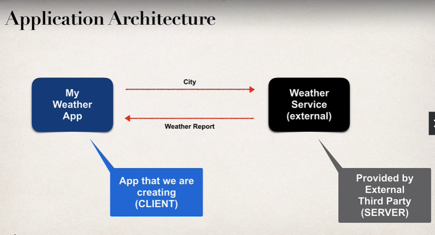

# BUSINESS PROBLEM

Build a client app that provides the weather report for a city.

So, we need to get the weather data from an external service since we ofcourse won't have the weather data in our own database as it changes all the time.

So, based on the architecture above, you may think - 

    1. How will we connect to the Weather Service?
    2. What programming language do we use?
    3. What is the data format?

Here are the answers - 

## 1. HOW WILL WE CONNECT TO THE WEATHER SERVICE?

We will make REST API calls over HTTP.

But, what is REST?

REST stands for "REpresentational State Transfer". A REST API is an API that comforms to the constraints of REST architectural style and allows for interaction with RESTful web services.

Okay, so "REST" is an architecture. What is an API then?

APIs are mechanisms that enable two software components to communicate with each other using a set of definitions and protocols.

For example, the Weather App that we are going to build talks to a weather system via APIs and shows you daily weather updates.

API architecture is usually explained in terms of client and server. The application sending the request is called the client, and the application sending the response is called the server. So in the weather example, the weather database is the server, and the app is the client. 

## 2. WHAT PROGRAMMING LANGUAGE DO WE USE?

So, is there a specific programming language to use REST APIs?

Well, REST is language independent. This means, the "client" can use any programming language and so does the "server". It doesn't matter if they both use the same language or different languages.

## 3. WHAT IS THE DATA FORMAT?

REST Applications can use any data format but the commonly used ones are "XML" and "JSON". JSON is the most popular and modern. JSON stands for "JavaScript Object Notation".

# POSSIBLE SOLUTION FOR OUR BUSINESS PROBLEM

So, we first need to find a weather service that has an API that we can use in our app. 

We can use https://openweathermap.org/ as they provide an API which we can use to get weather data. Data is available in multiple formats like XML, JSON etc.

Every API will always have a documentation so that users can know how to use that API. The same is the case with openweathermap. Here is the documentation - https://openweathermap.org/api

The API documentation shows that we hae to pass in the longitude and latitude for our desired location and we will get the weather data.

So, the API call will be made to this URL - 

    https://api.openweathermap.org/data/3.0/onecall?lat={lat}&lon={lon}&appid={API key}

# SOME MORE EXAMPLES

Let's some more examples.

Suppose, we want to build a currency converter application. One way is to manually write code for each and every currency and its conversion to each and every other currency. This is definitely not ideal.

Instead, why not use some external service that will take the currency and value as input, and then convert it to our desired currency.

Similarly, what if we want to create a Movie Tickets app where the user gives us the values for the movie, the location and the time and then we show the movie results. And again, we can delegate this process of looking up for movies based on the input from the user to an external movie tickets service.

Let's take an example of a CRM (Customer Relationship Manager) app. Suppose we have our frontend application written in some frontend javascript framework like Angular.

Now, the backend will be created using Spring Boot and we will use "Spring REST" to create the backend service that gives back a list of customers once the frontend app requests for it.

A common question is ... what do we call these services? Should we call them "REST APIs" or "RESTful APIs" or "REST Web Services" or "RESTful Web Services" or "REST Services" or "RESTful Services"?

Generally, they all mean the same thing.
