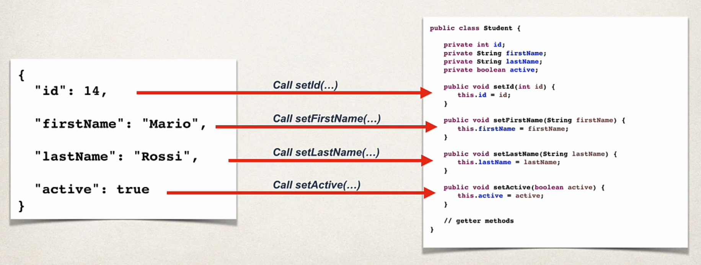

Data Binding is a process to convert the JSON data into a Java POJO or the other way around.

"POJO" stands for "Plain Old Java Object". 

It is an ordinary object that is not bound by any special restrictions. This means, a "POJO" should not have to extend some prespecified class or implement some prespecified interface or contain some annotations.

# JSON DATA BINDING WITH JACKSON

Behind the scenes, Spring uses "Jackson" project for Data Binding.The "Spring Boot Starter Web" dependency includes the dependency for "Jackson".

Here is the GitHub link of the project - https://github.com/FasterXML/jackson-databind

By default, Jackson will call the appropriate getter/setter methods when it handles the conversion.

Suppose, we have the following JSON object - 

    {
        "id": 14,
        "firstName": "Mario",
        "lastName": "Rossi",
        "active": true
    }

And suppose, we have a Java POJO "Student". 

When we have to do the data binding from the JSON to the POJO, Jackson will use the setter methods in the POJO. For example, it will use the setId() method to set the id of the POJO as 14, setFirstName() to set the first name as "Mario" and so on.

Similarly, when it has to convert from a POJO to JSON, it will use the getter methods for that. For example, for the id, it will use getId().

When building the Spring REST applications, Spring will automatically handle the Jackson integration. The JSON Data being passed to the REST controller is converted to POJO. Also, any Java object being returned from REST controller is converted to JSON.