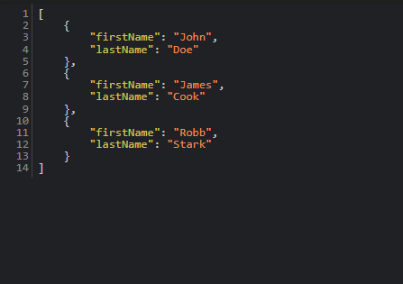
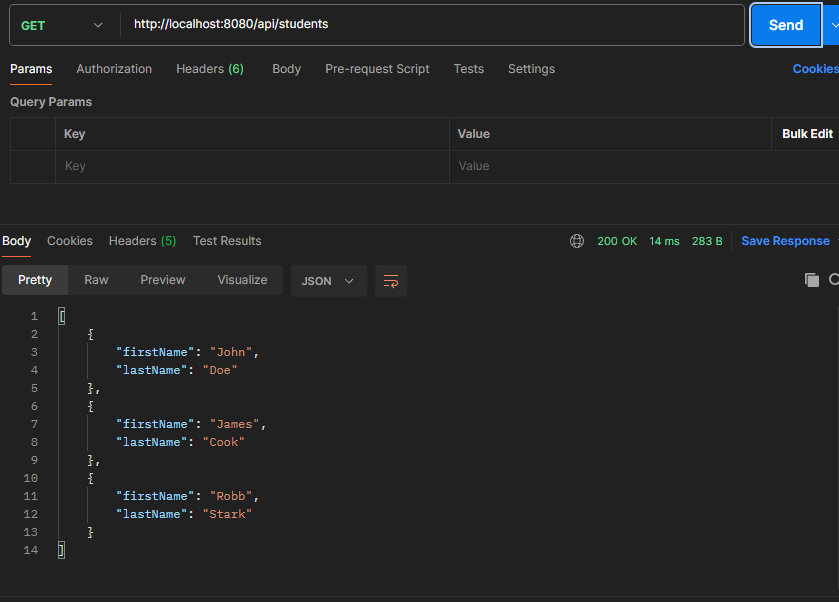

Let's now try whatever we learned so far in code.

We will create a new service that will return a list of students.

We will send a GET request to "/api/students" and this will return a list of students.

Now, our REST service will return a "List" and we have to convert it to JSON. But since we are using Spring, we do not have to worry about doing this conversion ourselves.

But, we do need to write code for the POJO class "Student". Because that's what Jackson will then use for the conversion.

Our "Student" POJO class will have two fields "firstName" and "lastName" and the respective getter and setter methods.

# STEP 1 - CREATE A JAVA POJO CLASS FOR STUDENT

This is what our POJO Class will look like - 

    public class Student {

        private String firstName;
        private String lastName;

        public Student() {}

        public Student(String firstName, String lastName) {
            this.firstName = firstName;
            this.lastName = lastName;
        }

        public String getFirstName() {
            return firstName;
        }

        public void setFirstName(String firstName) {
            this.firstName = firstName;
        }

        public String getLastName() {
            return lastName;
        }

        public void setLastName(String lastName) {
            this.lastName = lastName;
        }
    }

So, we simply have the fields, the constructors and the getters/setters.

# STEP 2 - CREATE @RESTCONTROLLER

Next, we have to define our Rest Controller.

We simply need to return a List of students and do not have to worry about the JSON because Jackson will take care of that.

    @RestController
    @RequestMapping("/api")
    public class StudentRestController {

        // Define endpoint for "/students" - return a list of students
        @GetMapping("/students")
        public List<Student> getStudents() {
            List<Student> students = new ArrayList<>();

            students.add(new Student("John", "Doe"));
            students.add(new Student("James", "Cook"));
            students.add(new Student("Robb", "Stark"));

            return students;
        }
    }

# STEP 3 - TIME TO TEST OUR CODE

Finally, let's test if our code is working or not.

To test if it is working fine, you can go to "http://localhost:8080/api/students" in the browser and if you see a JSON object with three Students, then it means it is working fine.

You can also use Postman to make a GET request to the above URL.

And we can see that even though we returned a Java List, the data that we get when we make a request is "JSON". And this conversion is handled by Jackson under the hood.