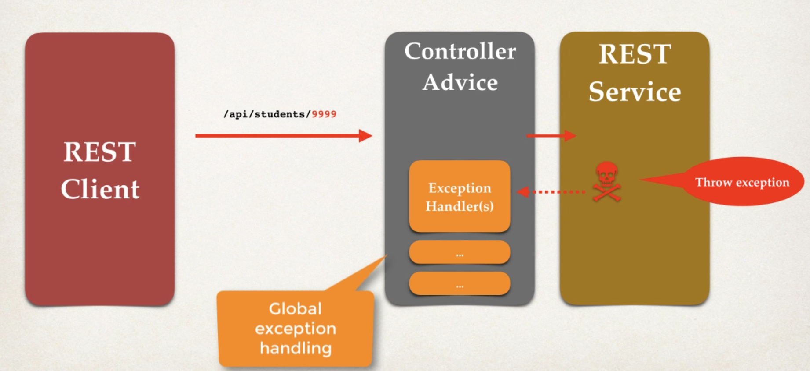

While we have added two Exception Handler methods in our Rest Controller, they are bound to that Controller itself. What that means is, if there is a "StudentNotFoundException" in some other Controller in our project, then that won't be handled by the Exception Handlers that we have defined in our current controller.

As the project grows, the number of possible exceptions that can occur will increase. Therefore, to reduce this problem and simplify error management as much as possible.

We need one place in our code that handles the exceptions raised from the entire application. So, no matter in what part of our application the exception occurs, Spring Boot will redirect it to the Global Exception Handler and it will take care of that.

# @CONTROLLERADVICE & @RESTCONTROLLERADVICE

To have a global exception handler in our project, we have to make use of an annotation "@ControllerAdvice". You can think of it as an interceptor of exceptions thrown by the methods that are annotated with @RequestMapping, @GetMapping, @PostMapping and other such annotations inside a controller.

This is actually a good example of AOP or Aspect Oriented Programming which we will talk about in detail later.

Another version of @ControllerAdvice is the @RestControllerAdvice which is a combination of two annotations - @ControllerAdvice and @ResponseBody.

So, @RestControllerAdvice is a more convenient annotation for handling the exceptions with Restful API.

So, if we use @ControllerAdvice, we have to implement methods such that they wrap the returned data inside "ResponseEntity". But, if we use @RestControllerAdvice, we do not have to do that because the @ResponseBody annotation takes care of that.

And this is the same behavior when we use @RestController annotation instead of @Controller because when we use @RestController, this annotation is a combination of @Controller and @ResponseBody.

This means, we do not even have to explicitly write the return type of a function in our controller as "ResponseEntity". So, we can refactor our Exception Handler methods like this - 

    @ExceptionHandler(StudentNotFoundException.class)
    @ResponseStatus(HttpStatus.NOT_FOUND)
    public StudentErrorResponse handleStudentNotFoundException(StudentNotFoundException e) {
        StudentErrorResponse error = new StudentErrorResponse();

        error.setStatus(HttpStatus.NOT_FOUND.value());
        error.setMessage(e.getMessage());
        error.setTimestamp(System.currentTimeMillis());

        return error;
    }

Note that now, we are simply returning the "StudentErrorResponse" object. We are not wrapping it inside a ResponseEntity because the @RestController annotation takes care of that. All we need to do is explicitly tell what will be the status of the response which we do using @ResponseStatus annotation (Otherwise it will be 200, which we do not want in this case).

So now, let's see the development process to implement global exception handling in our project.

## STEP 1 - CREATE A NEW @RESTCONTROLLERADVICE

We need a new class that will act as our global exception handler and it will include all the exception handler methods in it for various exceptions raised in our application.

And we will use @RestControllerAdvice annotation here.

    @RestControllerAdvice
    public class StudentRestExceptionHandler {...}

## STEP 2 - REFACTOR THE REST CONTROLLER AND REMOVE EXCEPTION HANDLING FROM IT AND MOVE IT TO GLOBAL EXCEPTION HANDLING CLASS

Now, we no longer need our exception handling methods inside a specific Rest Controller. We will move it to our Rest Controller Advice class.

So, after refactoring, our class will look like this - 
    
    @RestControllerAdvice
    public class StudentRestExceptionHandler {

        // Exception Handler for the StudentNotFoundException
        @ExceptionHandler(StudentNotFoundException.class)
        @ResponseStatus(HttpStatus.NOT_FOUND)
        public StudentErrorResponse handleStudentNotFoundException(StudentNotFoundException e) {
            StudentErrorResponse error = new StudentErrorResponse();

            error.setStatus(HttpStatus.NOT_FOUND.value());
            error.setMessage(e.getMessage());
            error.setTimestamp(System.currentTimeMillis());

            return error;
        }

        // Exception Handler for the Generic Exceptions

        @ExceptionHandler(Exception.class)
        @ResponseStatus(HttpStatus.BAD_REQUEST)
        public StudentErrorResponse handleGenericExceptions(Exception e) {
            StudentErrorResponse error = new StudentErrorResponse();

            error.setStatus(HttpStatus.BAD_REQUEST.value());
            error.setMessage(e.getMessage());
            error.setTimestamp(System.currentTimeMillis());

            return error;
        }
    }

And boom! We are done. Now, the exception handling is implemented globally across the application so that no matter which Rest Controller throws the specific exception, it will be handled by this Global Exception Handler.

And you can verify this if you create another controller and have a method there that throws an exception. You will see that being handled by the global exception handler as well.