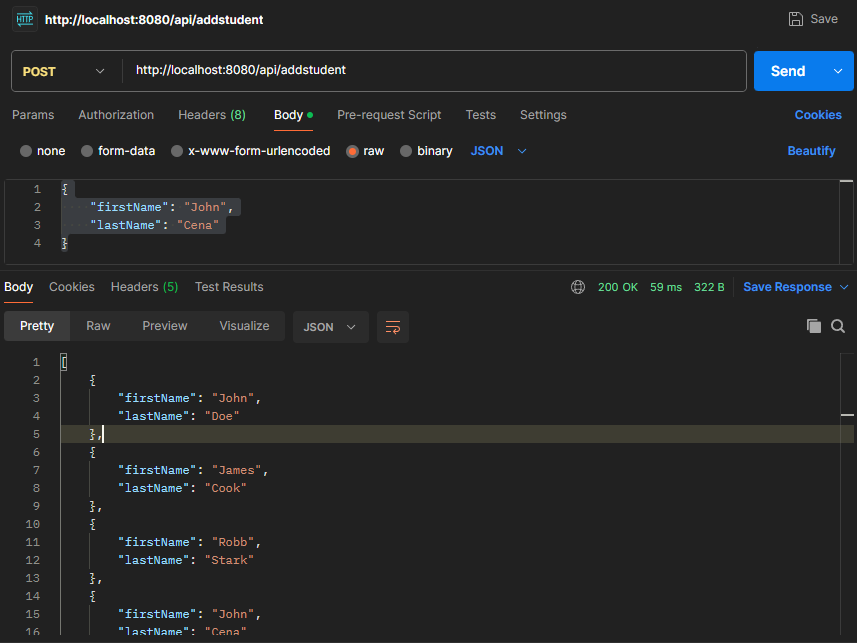
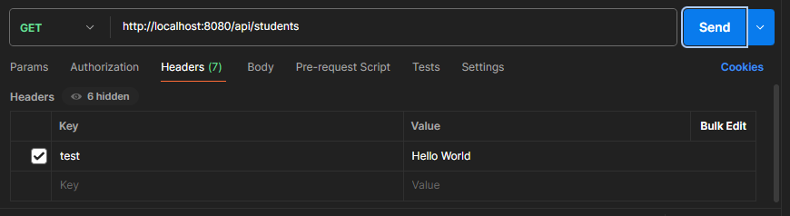

# PATH PARAMETERS / VARIABLES

In one of our previous sections, we learned how we can use path variables to have dynamic parts in the URL path. They are also called "Path Parameters" and are enclosed in curly braces.

For example, in a URL like /students/{id}, "id" is a path parameter. They're typically used to specify which resource or data a client is interested in.

We see examples of path parameters all the time on the web. For example, someone's social media profile link.

On Twitter, when you visit a user’s profile, the path parameter is used to specify the username in the URL, like this: https://twitter.com/username. Here, "username" is a path parameter that identifies the specific user whose profile you want to view. And for accessing posts: https://twitter.com/{username}/status/{postid}

GitHub uses path parameters to access specific repositories. For instance, the URL https://github.com/{username}/{repo} uses path parameters "username" and "repo" to specify the owner's username and the repository name, respectively.

Online stores often use path parameters to specify product details. For instance, https://examplestore.com/products/{product-id} may use "product-id" as a path parameter to identify a specific product.

# QUERY PARAMETERS

The path variables are not the only way, though. There is something called "Query Parameters" as well. 

Query parameters are key-value pairs appended to a URL after a question mark (?) and separated by ampersands (&). They are used to pass additional information to a server when making a request.

For instance, in the URL https://example.com/search?query=funny&category=comedy, "query" and "category" are query parameters. They enable filtering, sorting, and customization of requests.

In Spring Boot, we have the @RequestParam annotation to extract the query parameters from a URL and then use that in the method that handles the specific request.

For example, in our project, let's have another url "/studentsbyname" which is used by passing a query parameter named "startingLetter" which is use to specify the starting letter of students that we want to retrieve. So, you can consider this as some sort of filtering mechanism.

In our Rest Controller, we can define the method like this -

    @GetMapping("/studentsbyname")
    public List<Student> getStudentByMatchingLetter(@RequestParam(value = "startingLetter") String startingLetter) {
        return students.stream().filter(student -> student.getFirstName().toLowerCase().startsWith(startingLetter.toLowerCase())).toList();
    }

Note that the only change is that in the url, we do not use any curly braces or anything as such to show that there is a query parameter. 

We just have to use @RequestParam annotation and specify what will be the name of the query parameter that we want to map to the specific method parameter. And in this method, all that we are doing is filtering the students such that we return a list of students with first name starting with same letter as passed by "startingLetter" parameter.

This is how a valid URL will look like - 

    localhost:8080/studentsbyname?startingLetter=J

Now, what happens if we do not pass a query parameter?

What if we make a get request to simply -> "localhost:8080/studentsbyname".

We will get this as response - 

    {
        "status": 400,
        "message": "Required request parameter 'startingLetter' for method parameter type String is not present",
        "timestamp": 1721285264810
    }

So, at the moment, the query paramete is "required". But, we may not pass it all the time. Hence, just like in case of "Path parameters" or "Path variables", we can make it optional and there are two ways to do it.

First is using "required" attribute of @RequestParam -

    @GetMapping("/studentsbyname")
    public List<Student> getStudentByMatchingLetter(@RequestParam(value = "startingLetter", required = false) String startingLetter) {

        // If query parameter is not passed
        if (startingLetter == null) return students;

        return students.stream().filter(student -> student.getFirstName().toLowerCase().startsWith(startingLetter.toLowerCase())).toList();
    }

Second, is using "Optional" type for method parameter - 

    @GetMapping("/studentsbyname")
    public List<Student> getStudentByMatchingLetter(@RequestParam(value = "startingLetter") Optional<String> startingLetter) {

        // If query parameter is not passed
        if (startingLetter.isEmpty()) return students;

        return students.stream().filter(student -> student.getFirstName().toLowerCase().startsWith(startingLetter.get().toLowerCase())).toList();
    }

And now, since it is optional, we can add an "if" check in our method to check if we have a value for the "startingLetter" or not. If we do not have any value, we simply return the entire list. Otherwise, we will filter it based on the "startingLetter" value.

As mentioned in the beginning, we can have multiple query parameters in a single url. We just have to separate them using "&".

# REQUEST BODY

When we make "POST" or "PUT" calls to our Rest APIs, then we usually send some payload or data. And in our controller, we would like to have that complex payload or data converted to our "POJO" object automatically so that it is easy to then handle it.

For that purpose, we have the "@RequestBody" annotation.

Suppose we have a "POST" request to add a new student. And we are passing a JSON data in this POST call that has firstname and lastname of the student.

When we receive that data in our controller method, we would like to convert that JSON to the POJO. That's something we can do using @RequestBody.

So, in our Rest Controller, we can have this method - 

    // Add a new student
    @PostMapping("/addstudent")
    public List<Student> addStudent(@RequestBody Student student) {
        students.add(student);
        return students;
    }

Notice how we are using @RequestBody which takes the incoming JSON request body and converts it to an object of our "Student" POJO.

And in this method, all we are doing is adding this student object to our existing list of students and then returning this list of students as response.

To test it, you can use POSTMAN to make a POST request to "localhost:8080/addstudent" and then pass a JSON body as this - 

    {
        "firstName": "John",
        "lastName": "Cena"
    }

The response you will get will be the entire list of students which also contains this newly added student.

# REQUEST HEADERS

We can use Request Headers to send additional parameters along with the HTTP requests. We can use Request Headers to pass things like "authentication tokens" or "metadata. And in Spring Boot, to access the values of these Request Headers, we use @RequestHeader annotation and pass the name of the request header as the argument.

Let's say we make a GET request to get the list of students. But, we are also passing our custom Request header named "test" with a value as "Hello World". Now, in our method that handles this GET request, we want to extract the value of this "test" request header. We can do that using @RequestHeader annotation.

    @GetMapping("/students")
    public List<Student> getStudents(@RequestHeader(value = "test") String test) {
        System.out.println("Value of request header named test is: " + test);
        return students;
    }

So, we can use @RequestHeader and pass the name of request header in it. Then, Spring Boot will extract the value of this request header and put it in the "test" parameter which we can then use in our method.

What if we do not pass a request header named "test"? We will get an exception - 

    {
        "status": 400,
        "message": "Required request header 'test' for method parameter type String is not present",
        "timestamp": 1721286611644
    }

Because by default, this request header is now required. So again, we can make it optional in two ways - 

First, we can use the "required" attribute of @RequestHeader annotation - 

    public List<Student> getStudents(@RequestHeader(value = "test", required = false) String test) {...}

Second way is to use "Optional" type - 

    @GetMapping("/students")
    public List<Student> getStudents(@RequestHeader(value = "test") Optional<String> test) {...}

# COOKIES

Cookies are small pieces of text sent to your browser by a website you visit. They help that website remember information about your visit, which can both make it easier to visit the site again and make the site more useful to you.

In Spring Boot, we can use the @CookieValue annotation to extract cookie values.

    @GetMapping("/")
    public String readCookie(@CookieValue(value = "username", defaultValue = "abc") String username) {
        return "Hey! My username is " + username;
    }