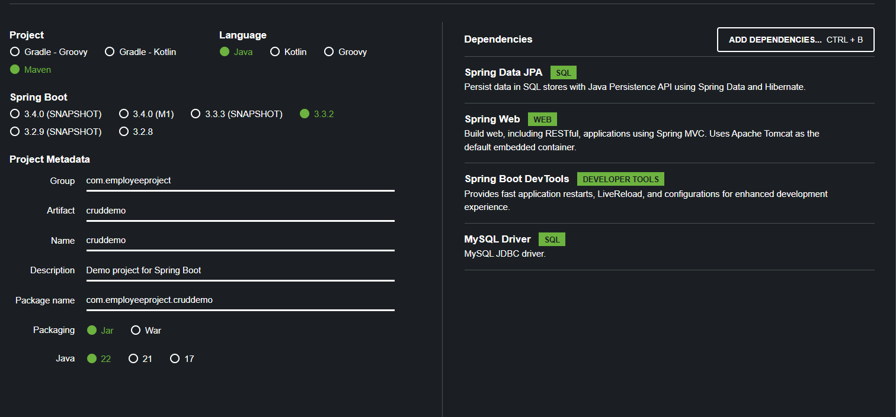

So far, we haven't had any real-time project that picks the data from a database whenever we make api calls. Let's do that now.

These are the API requirements -

We need to create a "REST" API for the Employee directory.

The "REST" clients should be able to - 

    - Get a list of employees
    - Get a single employee by id
    - Add a new employee
    - Update an employee
    - Delete an employee

# HTTP METHOD AND ENDPOINTS

So, let's decide on what HTTP method and what endpoint we will use.

To "Create" a new employee, we will use the HTTP POST method and the endpoint will be "/api/employees".

To "Read" a list of employees, we will use the HTTP GET method and the endpoint will be "/api/employees".

To "Read" a single employee, we will use the HTTP GET method and the endpoint will be "/api/employees/{employeeId}".

To "Update" an existing employee, we will use the HTTP PUT method and the endpoint will be "/api/employees".

To "Delete" an employee, we will use the HTTP DELETE method and the endpoint will be "/api/employees/{employeeId}".

# DEVELOPMENT PROCESS

Let's divide the development process into different steps.

First, we will set up the database.

Then, we will create a new Spring Boot project using the Spring Initializr.

And then we will start the main task of defining all the controller methods that do all the stuff we decided upon.

In Spring Boot, we will have a "REST" controller that will use a "Service" which in turn connects to a "DAO" and that "DAO" talks to the database. This will be the basic architecture of our project.

# SETTING UP THE DATABASE TABLE

Let's start by setting up the database table. In the current directory, you will find a "scripts" folder which has an SQL script that sets up a new database and a new table for employees.

So, simply go to MySQL Workbench, and run this SQL script, just like how we did in one earlier section. This script will create a new database and also add a new table with some rows in it.

# CREATING A NEW SPRING BOOT PROJECT

Next, we will use the Spring Initializr to create a new Spring Boot project.

Note that we have selected these dependencies - 

    - Spring Data JPA
    - Spring Web
    - Spring Boot DevTools
    - MySQL Driver
  
After you are done, generate the zip file and extract it in your preferred location and open the project in IntelliJ.