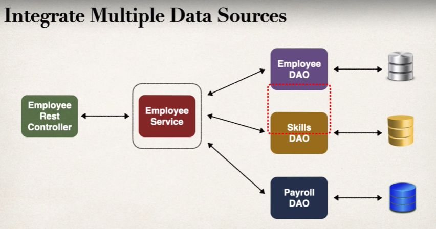

So far, our project has a Controller and a DAO. And a Controller is communicating directly with our DAO. Ideally, that's not what happens in large Spring projects.

Controllers are the classes which provide clients with APIs to interact with the project. If we connect controllers directly to the DAOs, any malicious message received by the controller will be sent to the DAO and in-turn to the Database which will be very unfortunate.

We can also use a Service layer to integrate data from multiple sources / DAO.

Many times the data received by the controller is raw in nature and needs some pre-processing before it can be actually used by the DAOs. Hence having a service layer is great way to provide some pre-processing steps before sending the inputs to the DAO layer.

It is generally advised to differentiate business logic and DAO as if the DAO becomes bulky it’ll be very difficult to track failures, detect bugs, make changes to DAO or the business logic. Having a service layer makes sense especially if you are dealing with a large codebase as modularity will help keep the code manageable.

In Spring Boot, like how we have a special @Controller or @RestController annotation for the "Controller", and @Repository annotation for the DAO, we also have a special "@Service" annotation for a Service class.

Thanks to component-scanning, Spring will automatically register the Service implementation when we use this annotation.

# STEPS TO ADD A SERVICE LAYER

## 1. DEFINE A SERVICE INTERFACE

Just as in case of a DAO, we need to first define an interface for our service that will then be implemented by a class.

    public interface EmployeeService {
        List<Employee> finalAll();
    }

## 2. DEFINE A SERVICE CLASS

Next, we need to define an "Impl" class that implements this interface and defines the methods.

    @Service
    public class EmployeeServiceImpl implements EmployeeService{
        @Override
        public List<Employee> findAll() {
            return null;
        }
    }

Notice that we are using the @Service annotation on this class so that Spring will automatically scan this class and register its bean.

## 3. INJECT AND USE DAO IN THE SERVICE CLASS

Next, instead of directly accessing the DAO in the Controller, we will now access it in the Service class by injecting it.

    @Service
    public class EmployeeServiceImpl implements EmployeeService{
        private EmployeeDAO employeeDAO;

        @Autowired
        public EmployeeServiceImpl(EmployeeDAO employeeDAO) {
            this.employeeDAO = employeeDAO;
        }

        @Override
        public List<Employee> findAll() {
            return employeeDAO.findAll();
        }
    }

## 4. REFACTOR THE CONTROLLER TO USE THE SERVICE CLASS

Finally, instead of using the DAO in the controller, we will now use the service class in the controller.

    @RestController
    @RequestMapping("/api")
    public class EmployeeController {

        // Inject Employee Service
        private EmployeeService employeeService;

        @Autowired
        public EmployeeController(EmployeeService employeeService) {
            this.employeeService = employeeService;
        }

        // Expose "/employees" and return a list of employees
        @GetMapping("/employees")
        public List<Employee> getEmployees() {
            return employeeService.findAll();
        }
    }

If you followed the steps properly, the application should now start without issues and you will be able to see the list of employees when you visit "http://localhost:8080/api/employees".