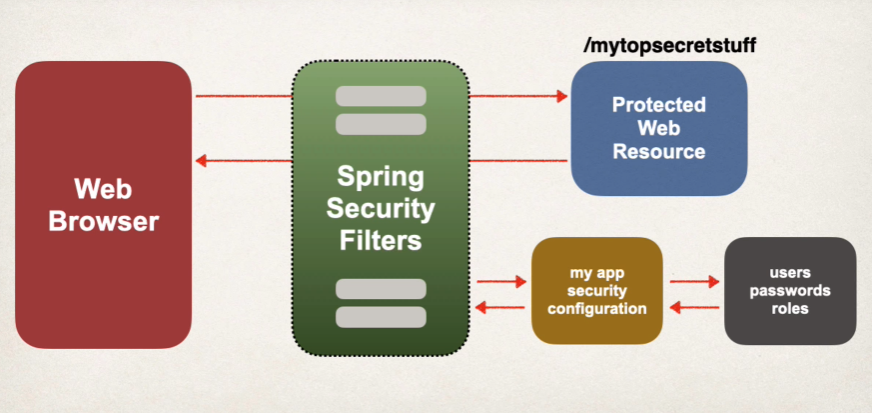
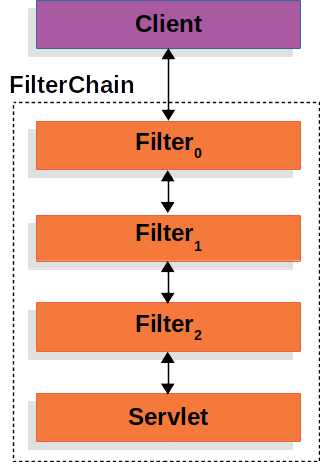

For Spring-based applications, the de-facto standard for security is the "Spring Security" framework.

Spring Security is a framework that focuses on providing both authentication and authorization to Java applications. Like all Spring projects, the real power of Spring Security is found in how easily it can be extended to meet custom requirements.

The "Spring Security" framework is implemented using "Servlet" filters in the background. There are two methods to secure an app - "Declarative" and "Programmatic".

The "Servlet" Filters are used to pre-process or post-process the web requests and they can route web requests based on the security logic.

Spring Security deals in "HttpServletRequest" and "HttpServletResponse" and doesn't care whether the requests come from a browser, a web service client, an HttpInvoker or an AJAX application.

# FILTERS IN SPRING SECURITY

Internally, Spring Security maintains a filter chain where each of the filters has a particular responsibility and they are added or removed from the configuration depending on which services are required.

It is almost like a "Middleware" pattern and it has the name of "FilterChain" because of the chain of responsibility pattern.

The name chain suggests that you have a sequence of filters, with each filter doing some processing and then passing on to the next in sequence, so each object has a chain member to point to the next filter in the sequence, which gets called after the filter has performed its processing. The last in the sequence will then probably have null as the chain value or it knows on its own that it is the last one in the sequence.

So, what happens is that a client will send a request to the application and the container creates a "FilterChain", which contains the "Filter" instances and the "Servlet" that should process the "HttpServletRequest", based on the path of the request URI.

In case of a Spring MVC application, the servlet is an instance of "DispatcherServlet". At most, one Servlet can handle a single "HttpServletRequest" and "HttpServletResponse".

Out of the box, Spring Security provides several securities filter. It is typically not necessary to know every filter but keep in mind that they work in a certain order or sequences.

Here is the entire ordering of the filters - https://docs.spring.io/spring-security/site/docs/4.2.1.RELEASE/reference/htmlsingle/#filter-ordering

# DECLARATIVE SECURITY

As mentioned in the beginning, there are two methods to secure an app - "Declarative" and "Programmatic".

In "Declarative" method, we define the application's security constraints in the configuration. This is handled by an All java config where we have a class annotated with @Configuration.

It provides a separation of concerns between application code and security.

# PROGRAMMATIC SECURITY

Spring Security provides in API for custom application coding. In this, we can have a greater customization for specific app requrements.

# ENABLING SPRING SECURITY

The first step is to add the "spring-boot-starter-security" dependency in the pom.xml file of your project. This will automatically secure all the endpoints for the application.

    <dependency>
		  <groupId>org.springframework.boot</groupId>
		  <artifactId>spring-boot-starter-security</artifactId>
	  </dependency>

And now, when you access your application, it will prompt you for logic. By default, the username is "user" and the password is automatically generated by Spring Security and shown in the terminal when the app starts. But, you can also define your own username and password -

    spring.security.user.name=test
    spring.security.user.password=somePassword123