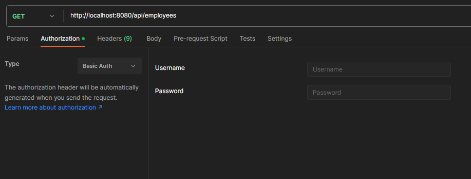
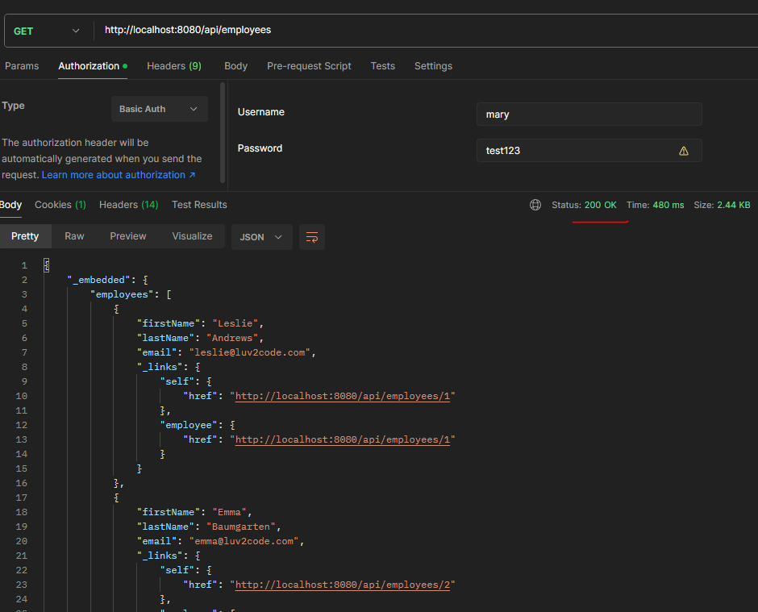

Let's say we have three users.

    - "john" with Role as "EMPLOYEE"
    - "mary" with Role as "EMPLOYEE" and "MANAGER"
    - "susan" with Role as "EMPLOYEE", "MANAGER", and "ADMIN"

Now,let's see how can we do basic security configuration in our project.

# STEP 1 - CREATE A SPRING SECURITY CONFIGURATION CLASS

The first step is to create a new class that is annotated with @Configuration.

    @Configuration
    public class DemoSecurityConfig {...}

It is important to understand how the passwords are stored in Spring Security framework. The format is - 

    {id}encodedPassword

"id" is an identifier that is used to look up which PasswordEncoder should be used and "encodedPassword" is the original encoded password for the selected PasswordEncoder.

The id must be at the beginning of the password, start with {, and end with }.

This "id" can have various values. Some common ones are - 

    noop -> Plain text passwords (No encryption, no hashing, nothing)
    bcrypt -> BCrypt Password Hashing
    pbkdf2 -> PBKDF2 (Password-Based Key Derivation Function 2) based password encoding
    ..... and more

For example, if we have "{noop}test123", then the password is "test123" and the encoding algorithm is "noop" which tells Spring Security that password is stored as plain text (Not recommended but good for practice).

# STEP 2 - ADD USERS, PASSWORDS AND ROLES

Next, in this configuration class, we have to define the users, their passwords and their roles.

For this, we have to add a Bean definition method in this configuration class.

    @Bean
    public InMemoryUserDetailsManager userDetailsManager() {
        UserDetails john = User.builder()
                .username("john")
                .password("{noop}test123")
                .roles("EMPLOYEE")
                .build();

        UserDetails mary = User.builder()
                .username("mary")
                .password("{noop}test123")
                .roles("EMPLOYEE", "MANAGER")
                .build();

        UserDetails susan = User.builder()
                .username("susan")
                .password("{noop}test123")
                .roles("EMPLOYEE", "MANAGER", "ADMIN")
                .build();

        return new InMemoryUserDetailsManager(john, mary, susan);
    }

So, let's see what this method does.

Note that the return type is "InMemoryUserDetailsManager". Here, this "InMemoryUserDetailsManager" class implements "UserDetailsService" interface to provide support for username/password-based authentication that is stored in-memory.

The "UserDetailsService" is the core interface that loads user-specific data and it is used throughout the framework as a user DAO. The only method that is has is "loadUserByUsername" which locates the user based on the username.

If you go to https://docs.spring.io/spring-security/site/docs/3.1.x/apidocs/org/springframework/security/provisioning/InMemoryUserDetailsManager.html

You will see that this class implements two interfaces -> "UserDetailsService" and "UserDetailsManager". 

Similarly, if you go to - https://docs.spring.io/spring-security/site/docs/current/api/org/springframework/security/provisioning/UserDetailsManager.html

Then it shows that this "UserDetailsManager" itself extends the "userDetailsService" interface. And there are basically five methods that this "UserDetailsManager" interface has - 

    - changePassword()
    - createUser()
    - deleteUser()
    - updateUser()
    - userExists()

So, you can now understand that this is an interface that provides methods that can be used to create and update users. In other words, it is to "manage" the users.

So, in our method, we are creating three users. These three will be of type "UserDetails", which is pretty self-explanatory.

And to create them, we use "User" class and its "builder()" method. The "User" class models the core user information retrieved by a "UserDetailsService".

So, we set the username, password, and role for each user. Note that the password we are setting has {noop} in the beginning which means that we are storing a plain-text password instead of encrypted one.

# TESTING OUR CODE

Now that we have added some users, let's try to access some endpoint. Let's try to make a get request to /api/employees to get a list of employees.

Previously, we were getting a list without any issues. But now, we will get "401 Unauthorized" response. And that's because we are now using Spring Security which secures all the endpoints so that we have to pass username and password to access the resources.

So, in Postman, we can go to the "Authorization" tab and select "Basic Auth" to provide a username and password.

And here, you can provide any one of the three users that we added in our application.

And boom! Now, we will be able to get a response with status code as 200.

So, we now have a basic setup in our application where we have specific set of users who can access the endpoints.