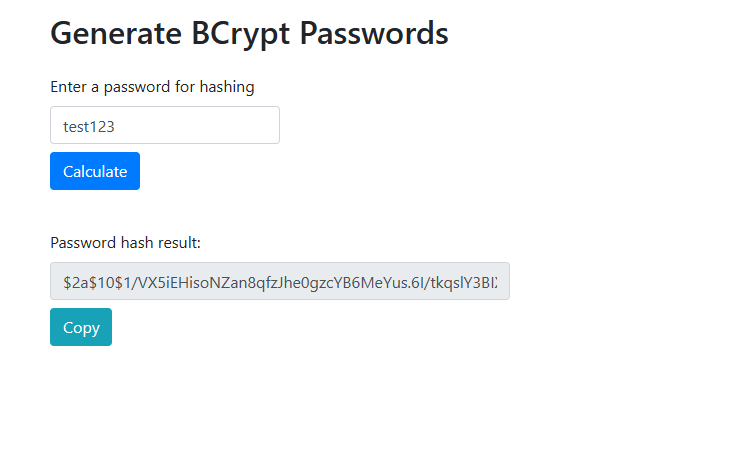

So far, we have stored the passwords in our database as plain texts. And this is something that is never recommended in a real world project. You should never store your passwords in plain text!! Because if your database gets compromised, all the user data will be revealed.

The best practice is to encrypt the passwords and then store that encrypted password in the database so that in case the database gets compromised, the hacker cannot know what the actual password for that user is.

As we already understood in previous sections, Spring Security has a specific format for password and thats like this - 

    {id}password

This "id" specifying the type of encryption and in case we want plaintext passwords, we have to use "noop" in place of "id".

But, let's say we use the "bcrypt" password hashing algorithm. In that case, the password will be like - 

    {bcrypt}encrypted_password

Spring Security team recommends the popular "bcrypt" algorithm. This algorithm will perform one-way encrypted hashing. It adds a random salt to the password for additional protection and includes support to defeat brute force attacks.

What does "one-way hasing" means?

It means that once the password is hashed, it cannot be reversed to its original form. This means, every time the user logs into their account, bcrypt hashes their password anew and compares the new hash value to the version stored in the system's memory to check if they match.

What does it mean by "salt"?

Instead of simply hashing the given password, bcrypt adds a random piece of data, called salt, to create a unique hash that is almost impossible to break with automated guesses during hash dictionary and brute force attacks.

# HOW TO GET A BCRYPT ENCRYPTED PASSWORD?

One way is to take the plain text password and use some utility online to perform the encryption. 

Another way is to write some java code to perform the encryption.

To keep it simple for now, lets try the option 1. In some section later, we will try option 2 as well. 

You can simply search for "Generate bcrypt password" on Google and go to any website you see. 

We will use this one - https://www.bcryptcalculator.com/

There, it will ask you to enter a plain text password first. Then, you can hit "Calculate" and it will give you the hashed password.

Remember that this generated password will be different for "test123" each time you hit calculate because of the random password salting. This means, for the same password, the hashed password won't be the same each time.

Now, we can use these encrypted passwords and add them to the database.

Before that, we just need to modify the sql so that the password field can accept up to 68 characters as the ecrypted password is pretty long.

This simple script will do that for us -

    ALTER TABLE users
    MODIFY COLUMN password VARCHAR(68) NOT NULL;    

And now, we can update the table to use the encrypted password instead of "test123".

    UPDATE users
    SET password = "{bcrypt}$2a$10$1/VX5iEHisoNZan8qfzJhe0gzcYB6MeYus.6I/tkqslY3BIXM6FwS"
    WHERE username IN("susan", "mary", "john")

# SPRING SECURITY LOGIN PROCESS

So, this is what happens now - 

    1. The password is retrieved from the database for the user
    2. The encryption algorithm is read via its id (for example, "bcrypt")
    3. Then, the plaintext password is encrypted using the salt from the database password
    4. The encrypted password is then compared to the password in the database
    5. If they match, then login is successful, otherwise it is not.

You may wonder... If bcrypt is a one-way hashing algorithm, how can we compare plaintext password to a bcrypt encrypted one? What about the salt?

Well, the thing is, the hashed password also contains the "salt" string that we used at the time of hashing the password.

    {bcrypt}$2a$10$1/VX5iEHisoNZan8qfzJhe0gzcYB6MeYus.6I/tkqslY3BIXM6FwS

So, the above hashed password is for the plaintext "test123".

This password has four parts.

The first part is - 

    $2b$ 
    
It shows the bcrypt algorithm version used.

The second part is - 

    $10$

This "10" is the cost factor which is nothing but salt rounds used while creating the salt string.

The third part is the first "22" characters which are the salt string. In our case, the salt string is - 

    1/VX5iEHisoNZan8qfzJhe

And finally, the remaining part is the hashed password - 

    0gzcYB6MeYus.6I/tkqslY3BIXM6FwS

So, when we enter "test123" as the password, Spring Security will use bcrypt to get the "salt" string and other values like the "rounds" from the database for that user, then use that "salt" string and other values to hash the plaintext password and then compare this newly generated hashed password with the one that is present in the database. That's how it compares the two.