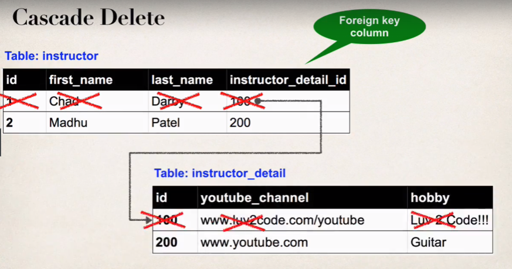

So far, we have done only some basic mapping stuff using JPA / Hibernate where we had a class and we mapped it to a table using various annotations in the Entity class such as @Table, @Column @Id etc.

But, that's not the only thing we can do using JPA / Hibernate.

In your database, you will generally work with more than one table and there will be relationships between tables.

And most of the time, we need to model this relationship using Hibernate.

We will understand three different types of advanced mappings in this section - 

    1. One-to-One Mapping
    2. Many-to-One & One-to-Many Mapping
    3. Many-to-Many Mapping

# ONE-TO-ONE MAPPING

Let's say we have two tables - "Instructor" and "Instructor Detail".

The "Instructor" Entity has the "first_name", "last_name", "email" and the "instructor_detail_id".

Now, this "instructor_detail_id" is referencing a column of "Intstructor Detail" table.

The "Instructor Detail" table has an "id", "youtube_channel", and "hobby".

This is an example of One-To-One mapping. For one specific instructor, we have only one entry in the "Instructor Detail" table.

# ONE-TO-MANY MAPPING

Now, an instructor can teach more than one courses, right? This is an example of One-To-Many mapping where one instructor has more than one courses.

# MANY-TO-MANY MAPPING

A course can have many students right? Moreover, a student can have many courses.

So, this is an example of a Many-to-Many mapping.

# IMPORTANT DATABASE CONCEPTS

This section is all about advanced mappings and it is very important to understand some basic database concepts like "Primary Key", "Foreign Key", "Cascading" etc.

## PRIMARY KEY

A Primary Key uniquely identifies a row of a table. It is an identifer. For example, if we have a "Student" table with columns as "id", "first_name", "last_name", "age", then here we can say that "id" will be the primary key because an "id" is different for each student so we can uniquely identify a student with its id.

It is also worth noting that it is not necessary that only one column can be the primary key. You can combine more than one columns to form one primary key.

For example, we can combine the "id" and "last_name" columns to form a primary key. But this does not mean that "last_name" by itself is a primary key. This is important to keep in mind.

## FOREIGN KEY

The foreign key links two table together. As an example, recall the "Instructor" and "Instructor Detail" tables we discussed above.

In the "Instructor" table, we had one column named "instructor_detail_id". And this column was referencing a column named "id" of the "Instructor Detail" table.

So, in the "Instructor" table, the foreign key column is "instructor_detail_id" because it links the two tables together.

So we can say that the "Foreign key" is a column in one table that refers to the primary key in another table.

"Referential Integrity" is one thing that is ensured when we use Foreign keys in a table. 

The data in a foreign key column is validated - the value can only be one that already exists in the table & column defined in the foreign key. It's very effective at stopping "bad data" - someone can't enter whatever they want - numbers, ASCII text, etc.

Also, if you update or delete the value in the referenced table, you can set it to automatically update the value or delete in cascade any row containing that value.

## CASCADE

When we learn about Foreign Keys, once concept that comes up is "Cascading".

"Cascading" means apply the same operations to related entities/tables.

For example, if we delete an instructor from "Instructor" table, then this means we should also delete their respective row in the "Instructor Detail" table. And this is something that can be done by "Cascading". And this is known as "CASCADE DELETE".

We have to be really careful with "CASCADE DELETE". Because, remember that there can be Many-to-Many mappinngs in our database between two tables.

Suppose, we have the "Course" and "Student" tables. We know that there is Many-to-Many mapping between the two.

Now, if we delete a student, that does not mean we should delete the respective course because there might be more than one students that are enrolled in that course. In this scenario, we definitely do not want to "CASCADE DELETE".

As a developer, we have a fine grain control and we can configure cascading.

## FETCH TYPES - EAGER & LAZY

In Hibernate / JPA, we have two types of ways in which we can fetch data - LAZY and EAGER.

"EAGER" will retrieve everything whereas "LAZY" will retrieve on request.

Taking the "Course" example, we may have the "Course" entity in our Spring project which has a "List of Student" that gives us all the students enrolled in that course. Now, we may not want to get this list all the time. Sometimes we may only want to get course details.

So by default, when the "Course" data is fetched from the database, all the students that are related to that course will also be fetched which we may not want in case there is a lot of data in the database.

When we use "LAZY", then it means that the list of students is only retrieved when we actually call the "course.getStudents()" method to get this list.

# ENTITY LIFECYCLE

In Hibernate / JPA, we deal with Entities. And an entity has a specific lifecycle where it can be in different states. These are the states that an entity can be -

## DETACH

If an entity is detached, it is not associdated with a Hibernate session.

## MERGE

If an entity is detached from sessiob, then merge will reattach it to the session.

## PERSIST

Transitions new instances to managed state. The next flush or commit will save it in the database.

## REMOVE

Transitions the managed entity to be removed. The next flush / commit will delete it from the database.

## REFRESH

Reload or sync the object with data from database. Prevents stale data.