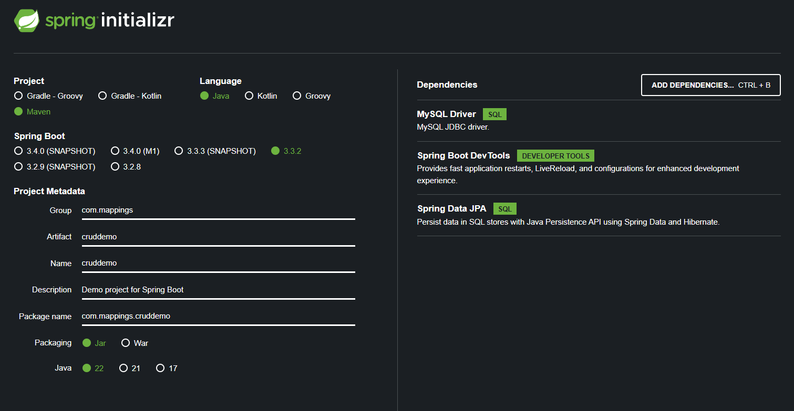
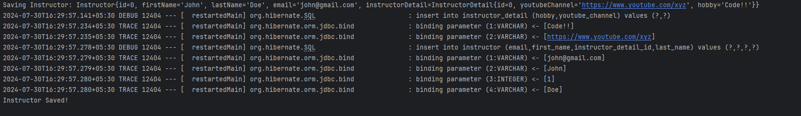

Let's start with The One-to-One mapping.

An "Instructor" can have an "instructor detail" entity.

Let's look at the steps for the development process in our Spring Boot Project.

# STEP 1 - DEFINE THE DATABASE TABLES

The very first step would be to create the required tables in the database. 

So first, we will define a new table named "instructor_detail". Note that we are not creating a table named "instructor" first. That's because we have to reference a specific column of "instructor_detail" inside "instructor". And so, "instructor_detail" needs to be created first.

In the current project's folder, you will find the "scripts" folder. In that, there is a folder named "hb-01-one-to-one-uni". Inside that, you will find an SQL script named "create-db.sql". This is what you can run to create the database, and the two tables.

You will see that this is the script to create a table for "instructor_detail" - 

    CREATE TABLE `instructor_detail` (
        `id` int NOT NULL AUTO_INCREMENT,
        `youtube_channel` varchar(128) DEFAULT NULL,
        `hobby` varchar(45) DEFAULT NULL,
         PRIMARY KEY (`id`)
    ) 

Note that we are defining a "PRIMARY KEY" and specifying the column that will be the "PRIMARY KEY". Here, it will be the "id" column.

In case of the "instructor" table, we have this - 

    CREATE TABLE `instructor` (
        `id` int NOT NULL AUTO_INCREMENT,
        `first_name` varchar(45) DEFAULT NULL,
        `last_name` varchar(45) DEFAULT NULL,
        `email` varchar(45) DEFAULT NULL,
        `instructor_detail_id` int DEFAULT NULL,
        PRIMARY KEY (`id`),
        KEY `FK_DETAIL_idx` (`instructor_detail_id`),
        CONSTRAINT `FK_DETAIL` FOREIGN KEY (`instructor_detail_id`) REFERENCES `instructor_detail` (`id`) ON DELETE NO ACTION ON UPDATE NO ACTION
    )

Here, note that the "PRIMARY KEY" is "id" and we also define a "FOREIGN KEY" -

    CONSTRAINT `FK_DETAIL` FOREIGN KEY (`instructor_detail_id`) REFERENCES `instructor_detail` (`id`)

This line means that the column "instructor_detail_id" references the column "id" in the "instructor_detail" table. The "FK_DETAIL" is simply a name that we have given to the foreign key.

If you are wondering about this line - 

    KEY `FK_DETAIL_idx` (`instructor_detail_id`)

Here, we are defining a "KEY". A "KEY" is simply the same as "INDEX". If you want to create an index for a column, you use "KEY" keyword. Indexes are used to find rows with specific column values quickly. Without an index, MySQL must begin with the first row and then read through the entire table to find the relevant rows. The larger the table, the more this costs.

# STEP 2 - CREATE A SPRING BOOT PROJECT

Next up, we will use the Spring Initializr to create a new Spring Boot project.

The dependencies that we will need are "MySQL Driver" and "Spring Data JPA". You can also add the "Spring Boot DevTools" if you like to.

And then, simply generate the zip, extract it, and then open the project in IntelliJ.

To see if everything works fine, you can print something in the "run" method after implementing the CommandLineRunner - 

    public class CruddemoApplication implements CommandLineRunner {

        public static void main(String[] args) {
            SpringApplication.run(CruddemoApplication.class, args);
        }

        @Override
        public void run(String... args) throws Exception {
            System.out.println("Hello World!");
        }
    }

But note that this will fail if you have not configured the datasoruce in application.properties - 

    spring.datasource.url=jdbc:mysql://localhost:3306/hb-01-one-to-one-uni
    spring.datasource.username=test
    spring.datasource.password=test

    # Turn off the Spring Boot banner
    spring.main.banner-mode=off

    # Reduce logging level. Set Logging level to warn
    logging.level.root=warn

And if the application starts and prints "Hello World", then we are all good.

# STEP 3 - CREATING AN INSTRUCTORDETAIL ENTITY

Now, we start with the actual code in our Spring Boot project. Let's start with creating the entities.

First, we will create our "InstructorDetail" class.

    @Entity
    @Table(name = "instructor_detail")
    public class InstructorDetail {

        @Id
        @GeneratedValue(strategy = GenerationType.IDENTITY)
        @Column(name = "id")
        private int id;

        @Column(name = "youtube_channel")
        private String youtubeChannel;

        @Column(name = "hobby")
        private String hobby;

        // GETTERS, SETTERS, and CONSTRUCTORS //

    }

Nothing new here as we have done all this already.

Next, we have to create the "Instructor" entity class.

    @Entity
    @Table(name = "instructor")
    public class Instructor {

        @Id
        @GeneratedValue(strategy = GenerationType.IDENTITY)
        @Column(name = "id")
        private int id;

        @Column(name = "first_name")
        private String firstName;

        @Column(name = "last_name")
        private String lastName;

        @Column(name = "email")
        private String email;

        // Set up the mapping between Instructor and InstructorDetail entities

        @OneToOne(cascade = CascadeType.ALL)
        @JoinColumn(name = "instructor_detail_id")
        private InstructorDetail instructorDetail;

        // GETTERS, SETTERS, and CONSTRUCTORS //
    }

In this case, you will see that we did something that we have never done before. And that's using the "@OneToOne" and "@JoinColumn" annotations.

Basically, we have these two classes named "Instructor" and "InstructorDetail" but they are independent. They are not linked together. To create a one-to-one mapping between two entities, we use the "@OneToOne" annotation.

    @OneToOne
    private InstructorDetail instructorDetail;

But this alone is not enough because at this point, we have no mentioned the foreign key column that actually relates the two tables together. And that column is the "instructor_detail_id" column in the "instructor" table. So, we will use another annotation to do that named @JoinColumn.

    @OneToOne
    @JoinColumn(name = "instructor_detail_id")
    private InstructorDetail instructorDetail;

And when we do this, hibernate can then take the value from the "instructor_detail_id" column, find the respective record inside "instructor_detail" table and then store it inside this property.

One thing we have not defined is CASCADE. What if we delete an instructor from the table? What happens with its detail in instructor_detail table?

The @OneToOne annotation takes an attribute named "cascade" that can have one of the following values - 

    1. PERSIST -> If the entity if persisted / saved, related entity will also be persisted.
    2. REMOVE -> If the entity if removed / deleted, related entity will also be deleted.
    3. REFRECH -> If entity is refreshed, related entity will also be refreshed.
    4. DETACH -> If entity is detached (not associated with Hibernate session), related entity will also be detached.
    5. MERGE -> If entity is merged, related entity will also be ,merged.
    6. ALL -> All of the above cascade types

So, let's use the "ALL" cascade type to cover all the cascade types.

    @OneToOne(cascade = CascadeType.ALL)
    @JoinColumn(name = "instructor_detail_id")
    private InstructorDetail instructorDetail;

And so, it means any operation like persist, refresh, remove, detach, or merge that we apply to our "Instructor" entity will also take place with the respective "InstructorDetail" entity.

If we do not specify a cascade type, then no operations will be cascaded which may cause unexpected results.

What if we want to configure multiple cascade types? If we want all, then we can use "ALL". What if we want only one or two? Well, the "cascade" attribute takes an array of values as well.

    @OneToOne(cascade = {CascadeType.DETACH, CascadeType.MERGE, CascadeType.PERSIST})

# STEP 4 - CREATING A DAO INTERFACE

Now that we are done with our Entity classes, now we need a DAO Interface that will talk to the actual database.

    public interface AppDAO {
        void save (Instructor instructor);
    }

So, it is just a simple interface with only one method to save the instructor.

# STEP 5 - CREATING A DAOIMPL CLASS

Next, we need to create an Impl class that implements this interface.

    @Repository
    public class AppDAOImpl implements AppDAO {

        private final EntityManager entityManager;

        @Autowired
        public AppDAOImpl(EntityManager entityManager) {
            this.entityManager = entityManager;
        }

        @Override
        @Transactional
        public void save(Instructor instructor) {
            entityManager.persist(instructor);
        }
    }

So, if you notice, we will save the "instructor" in the database using "persist". But, we have no extra code to save the detail of an instructor in "instructor_detail" table because since the CASCADE TYPE is ALL, when we save an instructor, its respective detail will be saved in the "instructor_detail" table automatically.

# STEP 6 - THE MAIN APPLICATION

Finally, we need to write code in our main file so that we can then run it and see the progress in terminal.

We basically, want to create a new "Instructor" object, create a new "InstructorDetail" object, bind them together and save the "Instructor" object to the database.

    private void createInstructor(AppDAO appDAO) {

		// Create the Instructor
		Instructor instructor = new Instructor("John", "Doe", "john@gmail.com");

		// Create the instructor detail
		InstructorDetail instructorDetail = new InstructorDetail("https://www.youtube.com/xyz", "Code!!");

		// Associdate the objects
		instructor.setInstructorDetail(instructorDetail);

		// Save the instructor to the database
		// This will also save the instructor details due to "CascadeType.ALL".
		System.out.println("Saving Instructor: " + instructor);
		appDAO.save(instructor);
		System.out.println("Instructor Saved!");
	}

So, note that there is nothing special going on here. But, behind the scenes, when we use "appDAO.save", then Hibernate will not only save the Instructor in the table, but it will also add a new row to the "instructor_detail" table.

And to see all this happening, we can enable the logging of the actual SQL statements by adding these in our application.properties - 

    logging.level.org.hibernate.SQL=trace
    logging.level.org.hibernate.orm.jdbc.bind=trace

If everything is fine, then you will see the same output as above image.

Note that it will first insert a new row in the "instructor_detail" table. And then, it will insert a new row in the "instructor" table. And this makes sense because the "Instructor" needs to know the "id" of the row in "InstructorDetail" so that's why the data is inserted in "instructor_detail" table first.

Also note that when it added a new row in "instructor_detail" table, the id of that row is "1". And it used the same value for the "instructor_detail_id" column of "instructor" table.

And if we go to our MySQL Workbench, we can actually see that the two table will get a new row each. So, everything is working as expected!