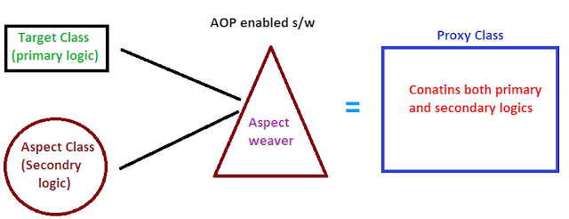

Let's say that in our application, we have a new requirement for "Logging".

So, we are asked to add logging to our "DAO" methods such that there are logging statements before the start of a method.

That shouldn't be that hard, right?

Now, we have a new requirement where we want to make sure that the user is authorized before running the DAO method. So, we need to add some security code to our DAO.

So, if we have a method let's say "addAccount" in our DAO, it should now look like this - 

    public void addAccount(Account account, String userId) {

        // CODE FOR LOGGING

        // CODE FOR SECURITY CHECK

        entityManager.persist(account);
    }

After some time, we have a requirement to do this for all the layers, whether it is the Controller or the Service. So, for each and every method, we need to add logging and security check.

Now if you think, we will be doing a ton of code duplication. And sometime in future if we have to make a change at some place, for example in the security check, we will have to go in each and every file where we have duplicated this code and then make the change there as well. This is a really bad.

So, we have two main problems here.

First is "CODE TANGLING" because we have the logging and security code tangled in a method.

Second is "CODE SCATTERING" because if we have to change logging or security code, we have to update all our classes one by one where we have copy pasted the code.

One possible solution can be to use "Inheritance" here so that we can have one class that has these logging and security check functionality and then we just inherit that class in all the classes where we need this functionality.

But, even that means we have to manaully go into the classes and extend the base class.

But then again, remember that Java does not support Multiple Inheritance which means if some class is already extending a class, we cannot make it extend another class.

Another solution is to use "DELEGATION" so that all the logging and security check related task is delegated to some logging manager or security manager. Still, we would need to update the classes if we want to add or remove logging and security, or add new features likle auditing, API management, instrumentation etc.

# THE SOLUTION - ASPECT-ORIENTED PROGRAMMING

The best solution is AOP or Aspect-Oriented Programming. It is a technique that promotes the separation of concerns in a software system.

Systems are composed of several components, each responsible for a specific piece of functionality. But often these components also carry additional responsibilities beyond their core functionality. 

System services such as logging, transaction management, and security often find their way into components whose core responsibilities is something else. These system services are commonly referred to as cross-cutting concerns because they tend to cut across multiple components in a system.

AOP addresses the problem of cross-cutting concerns, which would be any kind of code that is repeated in different methods and can't normally be completely refactored into its own module, like with logging or verification. 

This technique revolves around the concept of an "Asepct". An "Aspect" encapsulates the cross-cutting logic / concern.

An "Aspect" (It is just a class with some special annotations) can be reused at multiple locations.

# BENEFITS OF AOP

 - Code for Aspect is defined in a single class and it is much better than being scattered around. This promotes code reuse and we can easily change the code when we want to.

 - The business logic in your application is cleaner because we do not have any logic for logging or security checks inside the business methods in our app. This reduces code complexity.

 - Highly configurable. We can apply Aspects selectively to different parts of the app and there is no need to make changes to the main application code.

# SOME COMMON AOP USE CASES

The most common use cases of AOP are for "logging", "security" and "transactions".

We can also use AOP for "Audit Logging" for things like who, what, when and where.

We can use it for Exception Handling to log exceptions and to maybe do more things like notify the DevOps team via SMS / Email.

We can use it for API management to check things like how many times a method has been called or what are the peak times or the average load and so on.

# DISADVANTAGES OF AOP

Ofcourse AOP is not perfect. There are some disadvantages as well. 

 - Too many aspects and app flow is hard to follow
 - Minor performance sot for aspect execution (run-time weaving).Weaving is the process of applying aspects to a target object to create a new, proxied object.

# AOP TERMINOLOGY

There are some terms that commonly occur when we are learning AOP.

### ASPECT

An aspect is a module that encapsulates a cross-cutting concern. It contains advice and pointcuts.

### ADVICE

Advice is the code that runs when a particular pointcut is matched. There are different types of advice, including “before,” “after,” “around,” and “after-throwing.”

### POINTCUT

A pointcut is an expression that defines where an aspect’s advice should be applied in the codebase. It selects specific join points in your application.

### JOIN POINT

A join point is a specific point in the execution of a program, such as a method call, constructor invocation, or field access. We use it to tell Spring when to apply code during program execution.

## ADVICE TYPES

There are four types of advices - 

### BEFORE ADVICE

It runs before the method.

### AFTER ADVICE

It runs after the execution of a method. It does not matter if the method ran successfully or an exception was thrown. It is similar to a "finally" block.

### AFTER RETURNING ADVICE

In case you want the Advice to be triggered only if the method normally executes without throwing any exception, you can use After Returning advice.

### AFTER THROWING ADVICE

In case you want the Advice to be triggered only if the method throws any exception, you can use After Throwing advice.

### AROUND ADVICE

If you want some piece of code to be executed before and after a method is called, then you can use Around advice. This is the most powerful kind of advice. Around advice can perform custom behavior both before and after the method invocation.

It’s also responsible for choosing whether to proceed to the join point or to shortcut the advised method execution by providing its own return value or throwing an exception.

## WEAVING

When we talk about Spring AOP, then there is one term that we frequently get to hear and that's "Weaving".

"Weaving" is a process of inserting aspects into the application code at the appropriate point.

In this process, we link the aspect with other application types or objects to create an advised object. Weaving can be done at compile time, load time or runtime.

Spring AOP performs weaving at runtime.

In regards to performance, the slowest is the "run-time" weaving.

When we have to use AOP in our application, there are two leading frameworks in Java - 

    - Spring AOP
    - AspectJ

Spring AOP is something that Spring gives us. This one uses a "Proxy" pattern and due to runtime weaving, the proxy object will be built on the fly at runtime in the memory.

Compared to "AspectJ", it is simpler to use. We can actually migrate to AspectJ when using the @Aspect annotation.

The disadvantages are that it only supports method-level join points and can only apply aspects to beans that are created by Spring app context. Also, due to runtime weaving, there is a minor effect on the performance.

On the other hand, AspectJ suppports all the join points (method-level, constructor, field), not just methods. It works with any POJO and not just beans from app context. Compared to Spring AOP, it has a faster performance. AspectJ AOP performs compile weaving. This means your proxy class will be available whenever you compile your code. 

The downsides are that the compile-time weaving requires extra compilation step. You have to use the AspectJ compiler (ajc) for that. Moreover, the AspectJ pointcut syntax can become quite complex.

It is recommended to start with Spring AOP and only if there are complex requirements then move to AspectJ as Spring AOP is easier to get started with.

