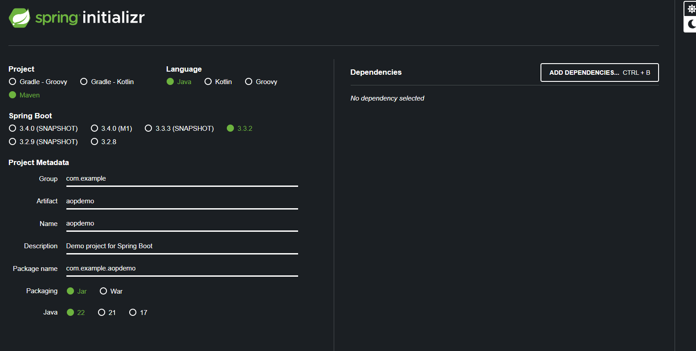

As the name suggests, this is the advice that is executed "before" a join point.

The most common use cases of a @Before advice is for logging, security and transactions.

In fact, the @Transactional annotation that we use on DAO methods uses the "AOP" behind the scenes to perform some operations before and after the transaction.

We can also use the @Before advice for audit-logging to get data about "who", "what", "when" and "where".

Another use case is API mangement to know how many times a specific method has been called or what are the peak times or what is the average load or who is the top user and so on.

# SPRING BOOT AOP STARTER

To add AOP functionality in our Spring Boot application, we have to add a new starter to our app that we have not discussed yet. It is the "spring-boot-starter-aop". Using this, Spring Boot will automatically enable support for AOP.

This also lets us skip adding the "@EnableAspectJAutoProxy" annotation as Spring Boot takes care of that under the hood. This annotation was used in non-Spring Boot projects to enable AOP support but it is not required anymore.

# SETTING UP THE PROJECT

As always, we will start with creating the Spring Boot project using the Spring Initializr. Note that the "spring-boot-starter-aop" dependency is not yet available on Spring Initializr website so we will add it manually in pom.xml later.

Once you import the project in the IDE, we can not add the aop starter in our pom.xml - 

    dependency>
		<groupId>org.springframework.boot</groupId>
		<artifactId>spring-boot-starter-aop</artifactId>
	</dependency>

Now we can implement the "CommandLineRunner" interface in our main file and then implement the "run" method to run some code in the terminal - 

    @SpringBootApplication
    public class AopdemoApplication implements CommandLineRunner {

        public static void main(String[] args) {
            SpringApplication.run(AopdemoApplication.class, args);
        }

        @Override
        public void run(String... args) throws Exception {
            System.out.println("Hello World");
        }
    }

# DEVELOPMENT PROCESS

Now, let's start with the main development process for our AOP related code.

## CREATING A TARGET OBJECT - DAO

First, we will create our target object which is a "DAO".

Here is our "AccountDAO" interface  -

    public interface AccountDAO {
        void addAccount();
    }

Nothing complex for now.

And here is our DAO Impl class - 

    @Repository
    public class AccountDAOImpl implements AccountDAO {

        @Override
        public void addAccount() {
            System.out.println(getClass() + ": DOING DB WORK: ADDING AN ACCOUNT");
        }
    }

## UPDATING THE MAIN APP

Now, we can call this method in our main app to see the result in terminal -

    @SpringBootApplication
    public class AopdemoApplication implements CommandLineRunner {

        private final AccountDAO accountDAO;

        public AopdemoApplication(AccountDAO accountDAO) {
            this.accountDAO = accountDAO;
        }

        public static void main(String[] args) {
            SpringApplication.run(AopdemoApplication.class, args);
        }

        @Override
        public void run(String... args) throws Exception {
            this.accountDAO.addAccount();
        }
    }

## CREATING AN ASPECT WITH @BEFORE ADVICE

And now comes the fun part. Let's now create an "Aspect" using the @Before advice.

For aspects, it is a good idea to have a separate package. So, create a new package named "aspect" and create a new class named "LoggingAspect" in it, considering we will use this to have all the code related to logging that we want to run before, after, or around methods.

    public class LoggingAspect {
    }

But how does Spring know that this is an "Aspect" class? Well, for that, we will use an annotation @Aspect.

Notice that @Aspect comes from "org.aspectj.lang.annotation.Aspect;". This means, it is from "AspectJ" library. And so, we also have to explicitly use "@Component" annotation on our class so that Spring will automatically include this class when it scans for components.

The reason we have to explicitly write it is because Spring cannot change the source code of @Aspect annotation to add the @Component annotation.

    @Aspect
    @Component
    public class LoggingAspect {
    }

And now, in this class, we will write all our "Advices". Remember than an "Advice" is simply a piece of code that we want to run at specific time.

So, let's create a new "Advice" related to logging. Let's start with "@Before" advice.

Remember we talked about "pointcut" expressions in the introduction? Well, when we use different advice annotations, we have to provide a pointcut expression which simply tells Spring Boot the exact location of method or methods to which we want this code to be attached.

    @Before("execution(public void addAccount())")
    public void beforeAddAccountAdvice() {
        System.out.println("\n=====>>> Executing @Before advice on addAccount()");
    }

So here, we are saying that we want this method to be called before the execution of the "addAccount()" method. Remember that we are not telling Spring Boot the exact location of this method. And this means that if there was another method named "addAccount()" in some other class than our DAO with the same "void" return type and "public access modifier, then this code will also run before the execution of that method.

There is no rule of what the method name for an advice need to be. It can be any name. In our case, we called it "beforeAddAccountAdvice"

And now, let's run our application and see what happens in the terminal.

Notice that the terminal prints this - 

    =====>>> Executing @Before advice on addAccount()
    class com.example.aopdemo.dao.AccountDAOImpl: DOING DB WORK: ADDING AN ACCOUNT

This means that indeed this code is being run "BEFORE" the execution of the "addAccount()" method. And that's the whole purpose of a "@Before" advice.

And note that this code will run "every" time the "addAccount()" method gets called. So, if we call it twice, the @Before advice gets called twice as well.

Moreover, if there are more than one classes with "public void addAccount()" method and they are called, then for all those, this advice method will be called.

And we can test that by creating a new "Service" interface with the same method as "DAO" interface - 

    public interface AccountService {
        public void addAccount();
    }

Now, let's implement it like this - 

    @Service
    public class AccountServiceImpl implements AccountService {

        private final AccountDAO accountDAO;

        public AccountServiceImpl(AccountDAO accountDAO) {
            this.accountDAO = accountDAO;
        }

        @Override
        public void addAccount() {
            System.out.println(getClass() + ": CALLING DAO METHOD: ADDING AN ACCOUNT");
            this.accountDAO.addAccount();
        }
    }

Note that in the "ServiceImpl" class, we have an "addAccount()" method that calls the "addAccount()" method of "DAO".

Now, let's use this method in our main class - 

    @Override
	public void run(String... args) throws Exception {
		this.accountService.addAccount();
	}

And if you run the app, here is what the terminal shows - 

    =====>>> Executing @Before advice on addAccount()
    class com.example.aopdemo.service.AccountServiceImpl: CALLING DAO METHOD: ADDING AN ACCOUNT

    =====>>> Executing @Before advice on addAccount()
    class com.example.aopdemo.dao.AccountDAOImpl: DOING DB WORK: ADDING AN ACCOUNT

So, we see that the "@Before" advice gets executed twice, one for the "addAccount()" method of the service because it is called from main class. And then once for the "addAccount()" method of the DAO because it is called from the service.

There is one very important thing to note. Our "pointcut" expression is like this - 

    @Before("execution(public void addAccount())")

Note that we have specifically said that the "addAccount()" method should have "void" as return type and "public" as the access modifier.

This means, if our service method "addAccount()" returns something, let's say a string - 

    @Override
    public String addAccount() {
        System.out.println(getClass() + ": CALLING DAO METHOD: ADDING AN ACCOUNT");
        this.accountDAO.addAccount();
        return "Hello World";
    }

Now, the terminal will say - 

    class com.example.aopdemo.service.AccountServiceImpl: CALLING DAO METHOD: ADDING AN ACCOUNT

    =====>>> Executing @Before advice on addAccount()
    class com.example.aopdemo.dao.AccountDAOImpl: DOING DB WORK: ADDING AN ACCOUNT

Note that it did not execute the @Before advice when the addAccount() method of the service was called. And that's because this method did not match the pointcut expression in our "Aspect" class.

So, always keep in mind that the "pointcut" expressions need to be written very carefully so that they work as expected.