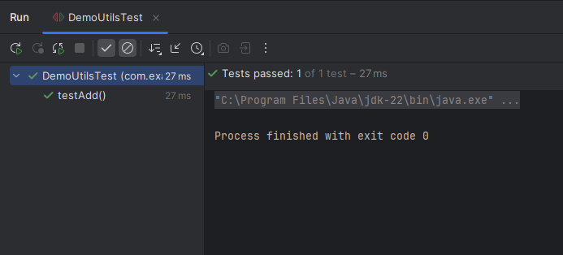

So, how do we work with JUnit? 

Well, the very first step ofcourse is to add the "Maven" dependencies for JUnit in our application.

    <dependency>
        <groupId>org.junit.jupiter</groupId>
        <artifactId>junit-jupiter-api</artifactId>
        <version>5.11.0</version>
        <scope>test</scope>
    </dependency>

Please note that when looking for JUnit dependency online, you will come across two versions - 

    - JUnit Vintage
    - JUnit Jupiter

The "junit-vintage-engine" is designed for tests written in older versions of JUnit, such as JUnit 3 and JUnit 4. This engine provides backward compatibility with older versions of JUnit. Additionally, it allows using older tests while taking advantage of the new JUnit 5 features.

The "junit-jupiter-engine" is the default testing engine in JUnit 5. It is designed to take advantage of the new capabilities of the JUnit 5 platform. This engine provides a wide range of testing styles and paradigms, including parameterized, nested, and dynamic tests, making it a highly versatile tool for testing Java applications.

Note that we have the "scope" set to "test" in the above dependency. It means the dependency is only for "test" purposes and it is not required for the normal execution of the application.

# CREATING A TEST PACKAGE

When we create a "test" package in our "test" folder, the convention is to create a similar package structure as the class that we are testing.

That's why, in the above image, you will see that the "test" package is named the same as the package for the code that we are testing.

This is just a convention and not any hard requirement. It is just easy to find the test classes in this way. Moreover, in case there are protected class members, then we can access them because the packages are the same.

# CREATING A UNIT TEST

The next step is the create a unit test. In general, the unit tests have the followign structure - 

    SETUP -> Create an Instance of the class to test
    EXECUTE -> Call the method you want to test
    ASSERT -> Check and verify the result

In JUnit, we have "annotations" that we can use in our test code and these are form of syntactic meta-data for better code readability and structure.

The most common annotation is the @Test which indicates that a particular method should be executed as one test case. The test method name can be anything. There is no specific naming requirement.

In our project, we have a class named "DemoUtils" and in that class, we have various methods that we want to test using JUnit.

So, let's say we have this method in our DemoUtils file - 

    public int add(int a, int b) {
        return a + b;
    }

When we write a test case for this, we can have any name for our test method but the general convention is to start the method with the word "test" -

    @Test
    public void testAdd() {...}

Notice the @Test annotation on this method which shows that this method should run as a test case.

So, let's see how can we write a simple test case in JUnit.

First step is the "SETUP" step where we will create a new instance of the "DemoUtils" class - 

    @Test
    public void testAdd() {

        // SETUP
        DemoUtils demoUtils = new DemoUtils();
    }

Then, we have to execute the "add" method and get the result that it returns - 

    @Test
    public void testAdd() {

        // SETUP
        DemoUtils demoUtils = new DemoUtils();
        
        // EXECUTE
        int actual = demoUtils.add(2,4);
    }

Finally, we have the "ASSERT" step where we check this returned result against our expected result - 

    @Test
    public void testAdd() {

        // SETUP
        DemoUtils demoUtils = new DemoUtils();
        
        // EXECUTE
        int actual = demoUtils.add(2,4);
        
        // ASSERT
        Assertions.assertEquals(6, actual, "2 + 4 must be 6");
    }

So here, "6" is the expected result and "actual" is the returned value when we called "add()". Note that we also have a third argument which is a String that says "2 + 4 must be 6". This is a message that shows up when we run our tests and they fail. In this way, we can know why the test failed.

# RUNNING THE UNIT TEST

Finally, its time to run the unit test that we just wrote.

We can simply run it like any other Java file in our IntelliJ IDE.

When it runs, we will see that it says "Test passed: 1".

Try to change the expected value from "6" to something else and then run the test. The test will obviously fail and you will see that the terminal now says -

    org.opentest4j.AssertionFailedError: 2 + 4 must be 6 ==>
    Expected :4
    Actual   :6

So, this is the message that we had written when we did the assertion step in our test class.

It will also show what is the "expected" value and what was actually returned by the method that was tested.