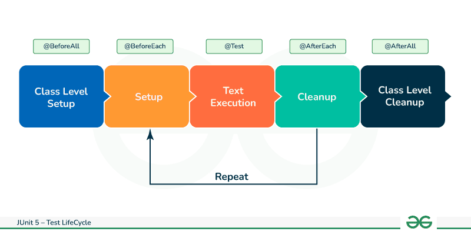

Most of the time, when we develop tests, we may need to perform some operations that are common to all the tests.

For example, before each test, we may need to create objects and set up the test data.

After each test, we will have to release the resources and clean up the test data.

For such use cases, JUnit provides our four annotations to work with - 

    @BeforeEach -> Executed before each test method
    @AfterEach -> Executed after each test method
    @BeforeAll -> Called only once before any of the test cases
    @AfterAll -> Called only once after any of the test cases

Note that if you are working with older version of JUnit, then you will not have @BeforeAll. Instead you will have @BeforeClass.

When we want to execute an expensive common operation before each test, it’s preferable to execute it only once before running all tests using @BeforeAll. For example, creation of a database connection or statup of a server.

# LET'S CODE

So, the tests that we have written so far have one thing in common.

In all the tests, we have to get an instance of the "DemoUtils" class. And since this is a common step for all the tests, we can put this inside a method annotated with @BeforeEach. In this way, this method will be executed before a test method executes.

    public class DemoUtilsTest {

        DemoUtils demoUtils;

        @BeforeEach
        public void init() {

            // SETUP
            demoUtils = new DemoUtils();
            System.out.println("BeforeEach executes before the execution of each test method!");
        }

        // TEST METHODS

    }

Note that it does not matter what you call the method that is annotated with @BeforeEach.

Now, if you run the test class, you will see that this gets printed in the terminal - 

    BeforeEach executes before the execution of each test method!
    BeforeEach executes before the execution of each test method!
    BeforeEach executes before the execution of each test method!

It was printed 3 times because we have 3 test methods in our class at this point and this means the @BeforeEach method is executed before each of those test methods.

At this point, we do not have to do any cleanup after each test method but just to see how it works, we can simply add - 

    @AfterEach
    public void cleanup() {
        System.out.println("AfterEach executes after the execution of each test method!");
    }

And as expected, the terminal will now print - 

    BeforeEach executes before the execution of each test method!
    AfterEach executes after the execution of each test method!
    BeforeEach executes before the execution of each test method!
    AfterEach executes after the execution of each test method!
    BeforeEach executes before the execution of each test method!
    AfterEach executes after the execution of each test method!

Similarly, we can add the @BeforeAll and @AfterAll methods as well - 

    @BeforeAll
    public static void initOnce() {
        System.out.println("BeforeAll executes only once in the beginning!");
    }

    @AfterAll
    public static void cleanupOnce() {
        System.out.println("AfterAll executes only once in the beginning!");
    }

Note that the @BeforeAll and @AfterAll methods must be static!

And now, the terminal will be like - 

    BeforeAll executes only once in the beginning!
    BeforeEach executes before the execution of each test method!
    AfterEach executes after the execution of each test method!
    BeforeEach executes before the execution of each test method!
    AfterEach executes after the execution of each test method!
    BeforeEach executes before the execution of each test method!
    AfterEach executes after the execution of each test method!
    AfterAll executes only once in the beginning!

So, as we can see, the @BeforeAll and @AfterAll code ran only once before and after the execution of all the test cases. On the other hand, the @BeforeEach and @AfterEach code ran before and after each test case.