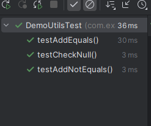
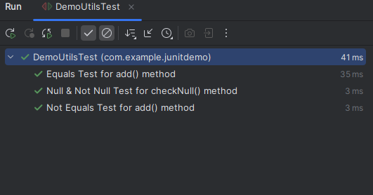
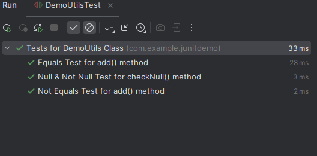

If we look at the terminal when we run the test class, we see that the method names are listed in teh test results which may not be useful if someone else is running the tests that we have written.

We may want to give a more descriptive names for the test and maybe include some spaces or special characters.

If we want to share the test reports then it is a good idea to have better names for the test results.

JUnit provides an annotation named @DisplayName which is used to set a custom display name for the specific test method and we can include spaces, special characters and even emojis in the name. This is useful for test reports in an IDE or external test runner.

This annotation can also be used over Classes to give a better name for the test class that contains the test methods.

So, we can write - 

    @Test
    @DisplayName("Equals Test for add() method")
    public void testAddEquals() {...}

    @Test
    @DisplayName("Not Equals Test for add() method")
    public void testAddNotEquals() {...}

    @Test
    @DisplayName("Null & Not Null Test for checkNull() method")
    public void testCheckNull() {...}

And now, when we run our tests, the test results will show these custom display names instead of the method names.

But there is still something odd here. We see the class name is still showing as "DemoUtilsTest". Let's give it a better name as well - 

    @DisplayName("Tests for DemoUtils Class")
    public class DemoUtilsTest {...}

And now it all looks much better and more readable.

# DISPLAY NAME GENERATORS

What if JUnit could generate a name for us? Well, JUnit provides this functionality as well and there are some generators that we can use - 

    Simple -> Removes trailing parentheses from the test method name
    ReplaceUnderscoes -> Replaces underscores in test method name with spaces
    IndicativeSentences -> Generate sentence based on the test class name and test method name

This annotation is a class-based annotation so it is used on a class and we simply specify the generator to use among the three.

For example, if we write - 

    @DisplayNameGeneration(DisplayNameGenerator.Simple.class)
    public class DemoUtilsTest {...}

Then, if there is a method named "testAddEquals()", it will be shown in test results as "testAddEquals" without any parenthesis. That's it.

If we write - 

    @DisplayNameGeneration(DisplayNameGenerator.ReplaceUnderscores.class)
    public class DemoUtilsTest {...}

Then, if there is a method named "test_AddEquals()", it will be shown in test results as "test AddEquals" without any underscores.

If we write - 

    @DisplayNameGeneration(DisplayNameGenerator.IndicativeSentences.class)
    public class DemoUtilsTest {...}

Then, if there is a method named "testAddEquals()", it will be shown in test results as "DemoUtilsTest, testAddEquals()".

We can even create oru custom display name generators. To write a custom display name generator, we have to write a class that implements the methods in the "DisplayNameGenerator" interface. The interface has methods for generating the name for a class, a nested class, and a method.