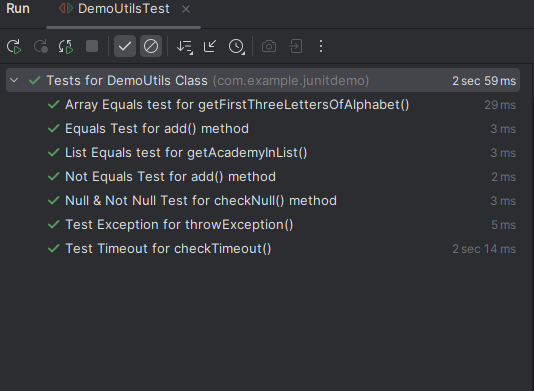
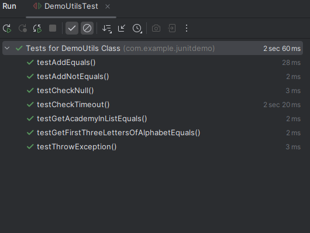
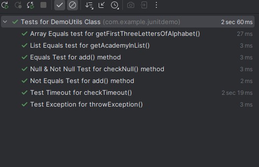
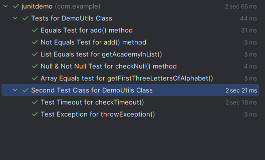
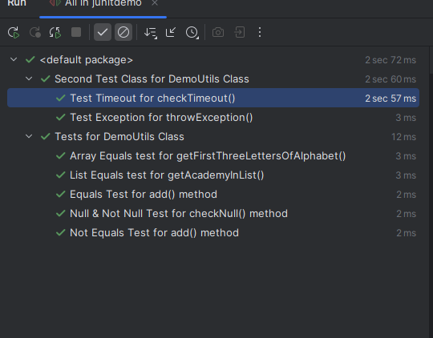

By default, JUnit runs tests using a "Deterministic" but "Unpredictable" order.

What this means is that the order is specific but it is not predictable.

In JUnit 5, we can override this to run tests in a determined order.

Now, in general, order should not be a factor in unit tests because there should not be any dependency between tests. All the tests must pass regardless of the order in which they run.

But, there are some specific use-cases where we may want the tests to be executed in a specific order. For example - 

    - You may want the tests to appear in alphabetical order for reporting purposes.

    - Sharing reports with project management, QA team etc.

    - Group tests based on functionality or requirements.

And for such requirements, we have an annotation named "@TestMethodOrder" which configures the order or sorting algorithm for the test methods.

We can use these three built-in order - 

    1. Alphanumeric
    2. @Order annotation
    3. Random Order
   
Under the "Alphanumeric" order, we have two ways - 

    1. MethodOrderer.DisplayName -> Sorts test methods alphabnumerically based on display names.
    2. MethodOrderer.MethodName -> Sorts test methods alphabnumerically based on method names.

Then we have "MethodOrderer.Random" or random ordering.

And finally, we have "MethodOrderer.OrderAnnotation" to sort the test methdos using the @Order annotation that we also learned about in the AOP section.

# ORDER BY DISPLAY NAME

Let's start with the very first type of ordering. We want to order our test methods based on their display names.

We can use the @TestMethodOrder annotation and this annotation is used on the class, not on methods. And it accepts the actual order that we want.

    @TestMethodOrder(MethodOrderer.DisplayName.class)
    public class DemoUtilsTest {...}

And now, if you check the order, the test methods will be ordered by their display names in the test results.

# ORDER BY METHOD NAME

What if we want to order the test methods by their method name. Maybe we have not provided custom display names to them.

So, we can write - 

    @TestMethodOrder(MethodOrderer.MethodName.class)
    public class DemoUtilsTest {...}

And now, the test methods will be ordered by their method names in the test results.

This one is only useful if we are not using the custom display names.

# RANDOM ORDERING

Then, we have the "Random" ordering of the test methods which means every time you run the test class, the order of the test methods will be different than the previous one.

You may think.... But why will someone use this?

This is actually a great way to make sure that all your test cases pass regardless of the order and it confirms that there are no dependencies between them.

    @TestMethodOrder(MethodOrderer.Random.class)
    public class DemoUtilsTest {...}

# USING @ORDER ANNOTATION

Finally, we can also use the @Order annotation which we already saw in the AOP section to run the Advices in a specific order.

We can do the same with the tests.

All we need to do is annotate the class like this - 

    @TestMethodOrder(MethodOrderer.OrderAnnotation.class)
    public class DemoUtilsTest {...}

And then, we need to use @Order annotation on our test methods and we can manually configure which tests to run first.

So, if we write -

    @Test
    @DisplayName("Equals Test for add() method")
    @Order(3)
    public void testAddEquals() {...}

    @Test
    @DisplayName("Not Equals Test for add() method")
    @Order(5)
    public void testAddNotEquals() {...}

    @Test
    @DisplayName("Null & Not Null Test for checkNull() method")
    @Order(4)
    public void testCheckNull() {...}

    @Test
    @DisplayName("Array Equals test for getFirstThreeLettersOfAlphabet()")
    @Order(1)
    public void testGetFirstThreeLettersOfAlphabetEquals() {...}

    @Test
    @DisplayName("List Equals test for getAcademyInList()")
    @Order(2)
    public void testGetAcademyInListEquals() {...}

    @Test
    @DisplayName("Test Exception for throwException()")
    @Order(7)
    public void testThrowException() {...}

    @Test
    @DisplayName("Test Timeout for checkTimeout()")
    @Order(6)
    public void testCheckTimeout() {...}

Now, this will be the order in which the test methods are executed - 

As we know already, the smaller the value, the higher the precedence.

What if two test methods have the same order value? Well, in tht case, they will be run using the default behavior. That is, a deterministic algorithm that is intentionally nonobvious.

# DEFINING OUR CUSTOM ORDER

It is also possible to define a custom order if we want to. For that, we have to implement the "MethodOrderer" interface and when we do that, we have to override a method named "orderMethods" in that class.

Let's say we want to order the test methods based on the length of their display names.

So, we can define a new class, let's call it "CustomOrder", and implement the "MethodOrderer" interface.

    public class CustomOrder implements MethodOrderer {

        @Override
        public void orderMethods(MethodOrdererContext context) {
            context.getMethodDescriptors().sort(
                    (MethodDescriptor m1, MethodDescriptor m2) -> m1.getDisplayName().length() - m2.getDisplayName().length()

            );
        }
    }

So now, we will sort the test methods based on their display names such that the test with the smallest display name is ran first and the one with the longest display name runs at the very last.

# SETTING DEFAULT ORDER USING PROPERTIES FILE

Anothe way to set the default method order is using the junit-platform.properties file. This file should be in the test/resources folder. 

We can add a property in this file to specify the method ordering - 

    junit.jupiter.testmethod.order.default = org.junit.jupiter.api.MethodOrderer$DisplayName

Other values that we can choose are - 

    org.junit.jupiter.api.MethodOrderer$MethodName
    org.junit.jupiter.api.MethodOrderer$DisplayName
    org.junit.jupiter.api.MethodOrderer$OrderAnnotation

And if we want to set the default order based on our custom ordering class, we have to provide the fully qualified class name - 
    junit.jupiter.testmethod.order.default = com.example.junitdemo.CustomOrder

And now, we do not even have to use the @TestMethodOrder annotation as we are specifying a default order in the properties file now.

But, still, if you use the @TestMethodOrder annotation in some test class when you already have a property defined in properties file, then that property will be overriden for that class by whatever value we are using inside @TestMethodOrder annotation.

This means, if in the properties file we have - 

    junit.jupiter.testmethod.order.default = com.example.junitdemo.CustomOrder

But our DemoUtilsTest class is like - 

    @TestMethodOrder(MethodOrderer.OrderAnnotation.class)
    public class DemoUtilsTest {...}

Then, for DemoUtilsTest, the methods will be ordered based on the @Order annotations, not by custom ordering.

# ORDERING JUNIT TEST CLASSES

We even have "Class" Ordering in JUnit if we have multiple test classes and we want to order them.

To see this in action, let's split our test class into two.

    @DisplayName("Second Test Class for DemoUtils Class")
    @TestMethodOrder(CustomOrder.class)
    public class DemoUtilsTest2 {

        DemoUtils demoUtils;

        @BeforeEach
        public void init() {

            // SETUP
            demoUtils = new DemoUtils();
        }
        
        @Test
        @DisplayName("Test Exception for throwException()")
        @Order(2)
        public void testThrowException() {...}

        @Test
        @DisplayName("Test Timeout for checkTimeout()")
        @Order(1)
        public void testCheckTimeout() {...}
    }

Suppose we have this second class named "DemoUtilsTest2". For now, we are putting the tests for same class in two different files which is not what you should do. But for now, just assume we have two diffferent test classes.

Now, to run both these classes at once, right click on the test package in which both are present and choose Run Tests in this package.

You will see something like above.

What if we want the tests in "DemoUtilsTest2" to be executed before the "DemoUtilsTest"?

Well, for that, we need to create a new file named "junit-platform.properties" in our src/test/resources folder and add this line in it - 

    junit.jupiter.testclass.order.default=org.junit.jupiter.api.ClassOrderer$OrderAnnotation

This will let us use the @Order annotation on classes.

And now, we can use the @Order annotation on our test classes.

    @Order(1)
    public class DemoUtilsTest2 {...}

    @Order(2)
    public class DemoUtilsTest {...}

Just like the "Methods", we have three other ways to order test classes - 

    Class Name -> org.junit.jupiter.api.ClassOrderer$ClassName
    Display Name -> org.junit.jupiter.api.ClassOrderer$DisplayName
    Random Order -> org.junit.jupiter.api.ClassOrderer$Random

And just like in case of Methods, we can also have custom ordering for classes. All we need to do is to implement the "ClassOrderer" interface.

Suppose we want to order test classes based on the length of their display names. We can write a custom order class as - 

    public class CustomClassOrder implements ClassOrderer {
    @Override
    public void orderClasses(ClassOrdererContext context) {
        context.getClassDescriptors().sort(
                (ClassDescriptor c1, ClassDescriptor c2) -> c1.getDisplayName().length() - c2.getDisplayName().length()
        );
    }
    }

And then, in the properties file, we can write - 

    junit.jupiter.testclass.order.default=com.example.junitdemo.CustomClassOrder

