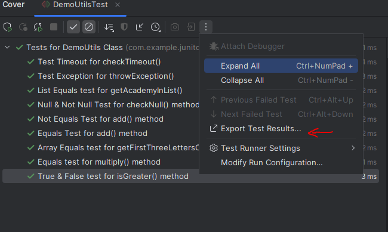
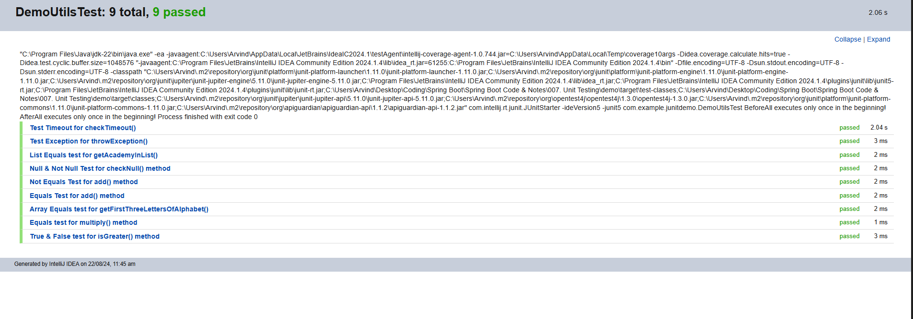

When we say "Code Coverage", it means how many methods of lines of code were called by our tests. The coverage is represented by a percentage. For example, 50% coverage.

In general, the higher the code coverage, the better. However, 100% is not always attainable. On most teams, 705 to 80% code coverage is acceptable.

Always keep in mind that code coverage is just a metric and it can always be tricked with bad tests. It should be used just as one data point in your software process.

Many IDE's have built-in support for code coverage. Same is the case with IntelliJ. We can generate code coverage reports in the IDE and it can also generate HTML output for viewing in the web browser.

When you right click the test file or package then IntelliJ has an option to Run the tests with "Coverage". 

Once you click that option, it will not only run the tests but will also show a code coverage report that shows how many lines of code / methods were called by your tests.

And if you double click on the class name in this coverage report, you can actually see what all methods are not covered by the tests.

So, all the methods that have a "Red" bar on their left are not yet covered as part of our unit testing.

We can also generate a code coverage report in HTML format. And in addition to that, IntelliJ can also generate test reports in HTML format and will show wich test passed and which one failed and so on.

To generate the code coverage report in HTML, just click on Generate Report button. This will ask you to choose the directory where you want the report to be saved. Once you select the directory, a new "htmlReport" folder will be created. All you need to do is open the "index.html" file in any browser and you are good to go.

Now, we can click on this package name, go in the class and it will show you the entire file and show you what methods are covered and what are not.

So right now, we do not have enough code coverage of 70-80% so lets try to write a test for the multiply() method.

    @Test
    @DisplayName("Equals test for multiply() method")
    @Order(8)
    public void testMultiply() {

        System.out.println("Running test: testMultiply");

        // EXECUTE
        int actual = demoUtils.multiply(2,4);

        // ASSERT
        assertEquals(8, actual, "2 * 4 must be 8");
    }

And now we see that our coverage for methods went to over 70%.

Let's also write a test case for the "isGreater" method as it is not covered as well.

    @Test
    @DisplayName("True & False test for isGreater() method")
    @Order(9)
    public void testIsGreater() {

        System.out.println("Running test: testIsGreater");

        // ASSERT
        assertTrue(demoUtils.isGreater(4,2));
        assertFalse(demoUtils.isGreater(2,4));
    }

And boom! We now have over 80% code coverage.

A proper 100% code coverage is rarely achievable and it makes no sense to try to get to 100% because in this process, you will end up writing some bad tests which you never want to do.

Finally, you can also generate HTML reports for your unit tests. For that, you have the same "Export Test Results" button for unit tests as well in IntelliJ. You can select what format you want, for example XML, HTML or some custom XSL template.

And once you export the test results as HTML and open  nthe browser, you will see the list of all the test cases and their results.