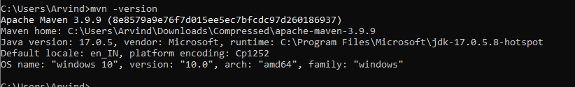
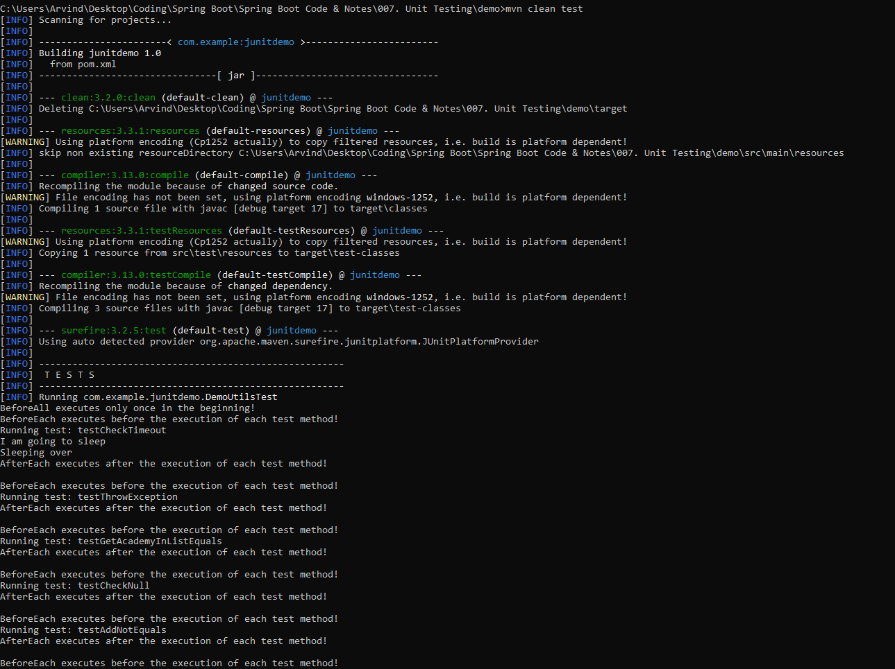
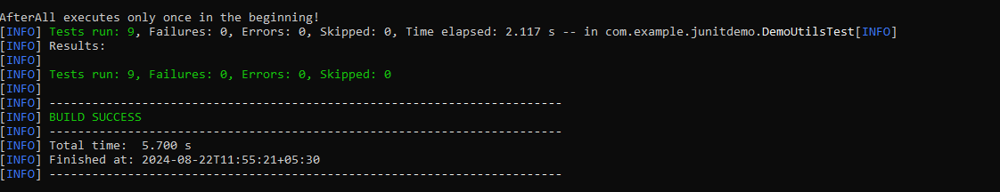
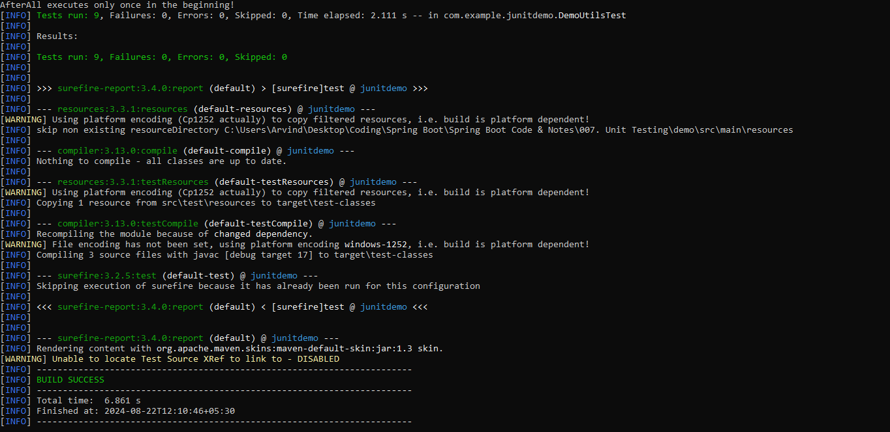
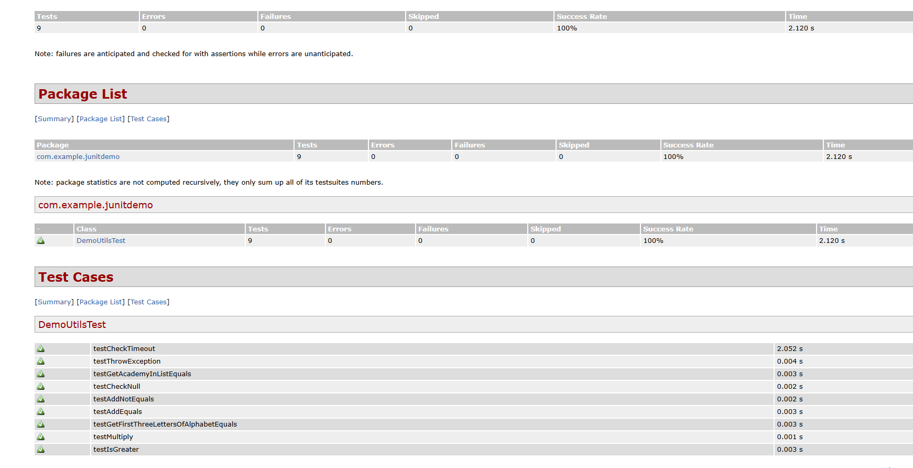
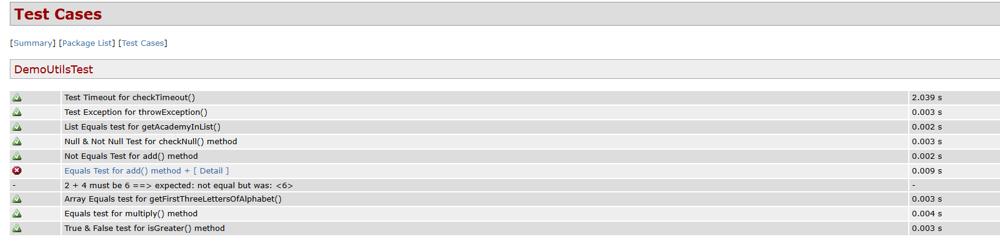
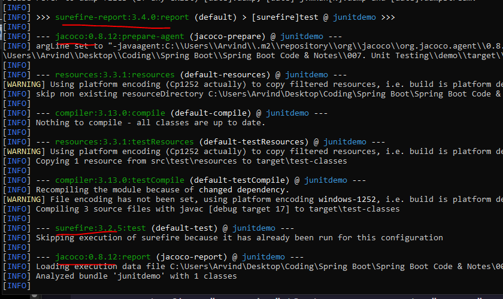
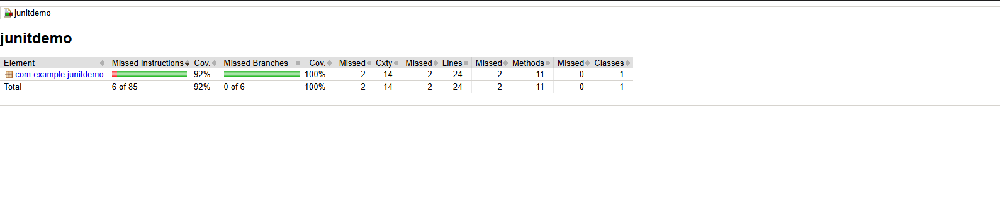

Not using IntelliJ? Do not worry.

We can also generate Code Coverage Reports using Maven commands which means no IDE is required in this case.

The benefit is that we can use this as a part of DevOps built to generate code coverage reports using the command line.

You must have "Maven" locally installed on your system before you start.

if you do not have Maven installed, follow the steps at - 

    https://maven.apache.org

All you need to do is download the zip file, extrat it, copy the file path of "bin" folder and then add that to the "Path" environment variable in your system.

If you are not sure if you have installed Maven already or just want to verify the installation, run this command - 

    mvn -version

If it runs then it means Maven is installed.

Next, all we need to do is run "mvn clean test" command while we are in the root of our project and then it will find all the unit test files and run the unit tests.

At the end, we will see that it found 9 unit tests and all the 9 tests were successful because we have no falilures or errors and no tests were skipped.

Now, how to generate the HTML Unit test reports?

For that, we have to install a plugin named "maven-surefire-report-plugin" in our POM.xml file.

Just add this at the end of POM.xml file - 

    <build>
        <plugins>

            <plugin>
                <groupId>org.apache.maven.plugins</groupId>
                <artifactId>maven-surefire-report-plugin</artifactId>
                <version>3.4.0</version>

                <executions>
                    <execution>
                        <phase>test</phase>
                        <goals>
                            <goal>report</goal>
                        </goals>
                    </execution>
                </executions>
            </plugin>
    </build>

Note that we are using the executions tag here where we say that during the Maven's "test" phase, execute the plugin goal "report". So, basically, it will execute this command - 

    maven-surefire-report-plugin:report

And now, if you run the "mvn clean test" command again, you will see a similar output as before but now, there are some extra lines in the command prompt after it shows how many test ran  - 

And now, if you go to the root folder of your project and inside "target -> site" then you will find an HTML file there named "surefire-report.html". 

Just open that in the browser and boom! We have our report!

Now, by default, the Maven Surefire Plugin will NOT generate the report if the tests fail. But ofcourse that is not what we want. We want it to geenrate a report, doesn't matter if the tests fail or pass.

For that, we can add a new "confirmation" section in our pom.xml for  "maven-surefire-plugin" - 

    <plugin>
        <groupId>org.apache.maven.plugins</groupId>
        <artifactId>maven-surefire-plugin</artifactId>
        <configuration>
            <testFailureIgnore>true</testFailureIgnore>
        </configuration>
    </plugin>

Now, if you have any test that is failing and you run "mvn clean test", it will still generate the report that shows you the failures as well.

One thing you will note is that the report does not show the "Display Names" that we have set for our test methods. Instead, it shows the method names. 

Again, you have to add an entry in the configuration of the "maven-surefire-plugin".

     <configuration>
        <testFailureIgnore>true</testFailureIgnore>
        
        <statelessTestsetReporter implementation="org.apache.maven.plugin.surefire.extensions.junit5.JUnit5Xml30StatelessReporter">
            <usePhrasedTestCaseMethodName>true</usePhrasedTestCaseMethodName>
        </statelessTestsetReporter>
    </configuration>

And now, the test cases will have their Display Names shown in the report.

# GENERATING CODE COVERAGE REPORTS

What about the Code Coverage Reports? Well, we can use a library named "JaCoCo" where it stands for "Java Code Coverage". There is a maven plugin that we can use for Code Coverage.

Here is the official documentation - https://www.eclemma.org/jacoco/trunk/doc/maven.html

    <plugin>
        <groupId>org.jacoco</groupId>
        <artifactId>jacoco-maven-plugin</artifactId>
                
        <executions>
            <execution>
                <id>jacoco-prepare</id>
                <goals>
                    <goal>prepare-agent</goal>
                </goals>
            </execution>
                    
            <execution>
                <id>jacoco-report</id>
                <phase>test</phase>
                <goals>
                    <goal>report</goal>
                </goals>
            </execution>
        </executions>
    </plugin>

In the first "execution" block, we prepare the "Jacoco" agent and the goal is bound by default to the maven's "initialize" phase.

In the second "execution" block, we say that during the maven's test phase, execute the plugin goal "jacoco-maven-plugin:report".

Now, when you run "mvn clean test", you will see that the necessary commands related to jacoco will also be executed at the necessary places.

To see the code coverage report, to to the target -> site -> jacoco folder and there, you have an "index.html" file that you can open in browser.

And boom! We have our code coverage report!

You will also see that in this "jacoco" folder, we also have an Excel file with the code coverage report in an Excel sheet.