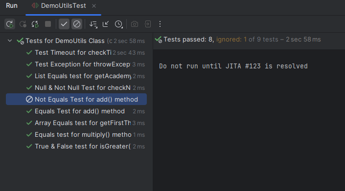
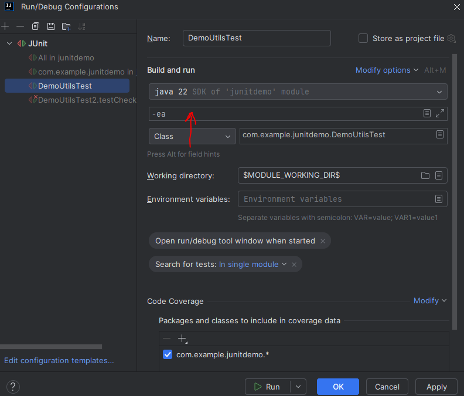
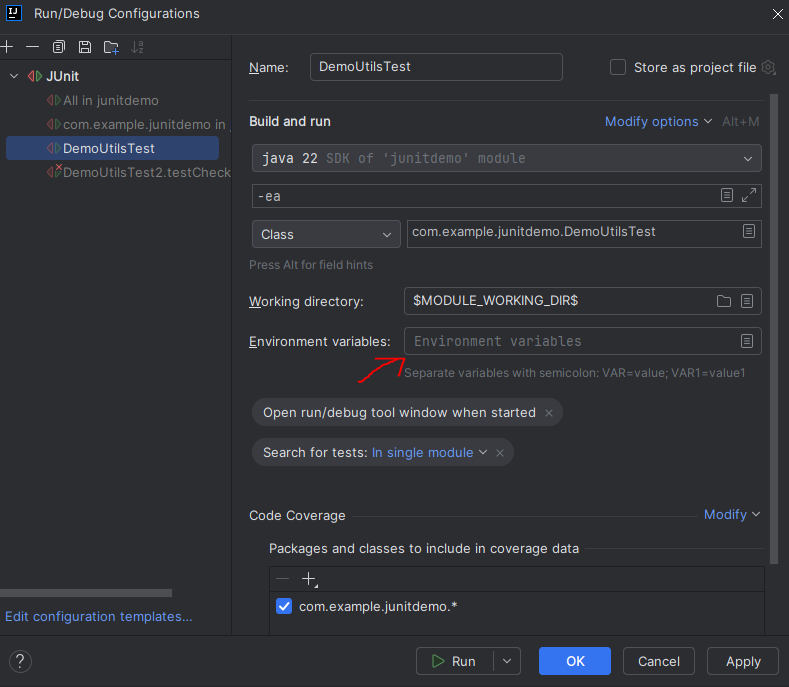

We can control our tests such that we can choose what tests to run and what no based on conditions that we specify.

Take the following scenarios -

There is some method that is broken so we are waiting for the dev team to fix it. This means, until that fix is deployed, it doesn't make sense to run the tests that are associated with that method. And so, we should not run them.

OR

A test should only run for a specific version of jav (for example, Java 18) or for a specific range of versions only (for example, 13-18)

OR

A test should only run on a specific operating system. For example, Windows, Mac or Linux.

OR

A test should only run if specific environment variables or system properties are set.

Now you may think....

If we have to skip some tests, why not just go and comment out that particular test method?

Yes, we can do that but then those tests won't show up in the reports. We want to show those tests in the report even if we did not run them.

Also, if we comment out tests, it is very easy to forget about them later because they won't ever show up in the reports.

And when it comes to specific use cases like enabling or disabling the tests for specific OS, then it will be a manual process to do all that.

# ANNOTATIONS THAT JUNIT PROVIDES FOR THIS REQUIREMENT

There are some annotations that JUnit provides which can help us in writing conditional tests.

 - @Disabled - Disable a test method
 - @EnableOnOs - Enable test when running on given Operating System
 - @EnabledOnJre - Enable test for a given Java version
 - @EnabledForJreRange - Enable test for a given Java version range
 - @EnabledIfSystemProperty - Enable tests based on JVM system properties
 - @EnabledIfEnvironmentVariable - Enable tests based on environment variables

These annotations can be applied not just on individual test methods but also on the entire test class.

# @Disabled ANNOTATION

Let's say we have a test - 

    @Test
    @DisplayName("Not Equals Test for add() method")
    public void testAddNotEquals() {... }

We do not want to run it until some JIRA issue is not resolved. So, we can write  -

    @Test
    @DisplayName("Not Equals Test for add() method")
    @Disabled("Do not run until JITA #123 is resolved")
    public void testAddNotEquals() {...}

Now, even though this test won't run, it will show up in the test report as an ignored test.

# @EnabledOnOs ANNOTATION

Similarly, let's say we only want to run a test when the operating system is Windows. So, we can write - 

    @Test
    @DisplayName("Not Equals Test for add() method")
    @EnabledOnOs(OS.WINDOWS)
    public void testAddNotEquals() {...}

Or, if we want it to be enabled only on MAC - 

    @Test
    @DisplayName("Not Equals Test for add() method")
    @EnabledOnOs(OS.MAC)
    public void testAddNotEquals() {...}

Or, if we want it to be enabled only for Windows and Linux but not for MAC - 

    @Test
    @DisplayName("Not Equals Test for add() method")
    @EnabledOnOs({OS.WINDOWS, OS.LINUX})
    public void testAddNotEquals() {...}

# @EnabledOnJre ANNOTATION

Let's say we want to run a test only for a specific Java version. Then, we can use the @EnabledOnJre annotation.

Suppose, we only want to run a test if Java version is 17. So, we will write - 

    @Test
    @DisplayName("Not Equals Test for add() method")
    @EnabledOnJre(JRE.JAVA_17)
    public void testAddNotEquals() {...}

# @EnabledForJreRange ANNOTATION

What if we want a test to run for all the java versions in the range 13 to 17? We can use the @EnabledForJreRange annotation.

    @Test
    @DisplayName("Not Equals Test for add() method")
    @EnabledForJreRange(min=JRE.JAVA_13, max=JRE.JAVA_17)
    public void testAddNotEquals() {...}

Or, maybe we just want a minimum java version of 17. So, we can say -

    @Test
    @DisplayName("Not Equals Test for add() method")
    @EnabledForJreRange(min=JRE.JAVA_17)
    public void testAddNotEquals() {...}

By default, the "min" value is JAVA_8 and the maximum value is the maximum possible JRE version

# @EnabledIfSystemProperty ANNOTATION

Let's say we want to enable a test if there is a system property set named "HELLO" and its value is "WORLD".

So, we can write - 

    @Test
    @DisplayName("Not Equals Test for add() method")
    @EnabledIfSystemProperty(named="HELLO", matches="WORLD")
    public void testAddNotEquals() {...}

So, here, this line -

    @EnabledIfSystemProperty(named="HELLO", matches="WORLD")

says that enable the test if the system property named "HELLO" has a value that matches "WORLD".

Now, the value that we pass for "matches" is a regular expression. For example, we can write -

    @Test
    @DisplayName("Not Equals Test for add() method")
    @EnabledIfSystemProperty(named="LC_TIME", matches=".*UTF-8.")
    public void testAddNotEquals() {...}

But how do we set a system property? Well, in the IntelliJ IDE, go to Run -> Edit configurations and in the box for VM options, you can add system properties like this - 

    -D<propName> = <value>

For example, if we want to set a property named "HELLO" to a value named "WORLD", we can say - 

    -DHELLO=WORLD

# @EnabledIfEnvironmentVariable ANNOTATION

Similarly, we can use the EnabledIfEnvironmentVariable annotation if we want to run a test only if a specific environment variable exists in your system.

    @Test
    @DisplayName("Not Equals Test for add() method")
    @EnabledIfEnvironmentVariable(named="HELLOW", matches="WORLD")
    public void testAddNotEquals() {...}

And just like the previous property, the "matches" attribute takes in a regular expression.

We can see Environment Variables by going to Run -> Edit Configurations and in the box for the Environment Variables, you can add properties like this - 

    name=value

For example - 

    HELLO=WORLD