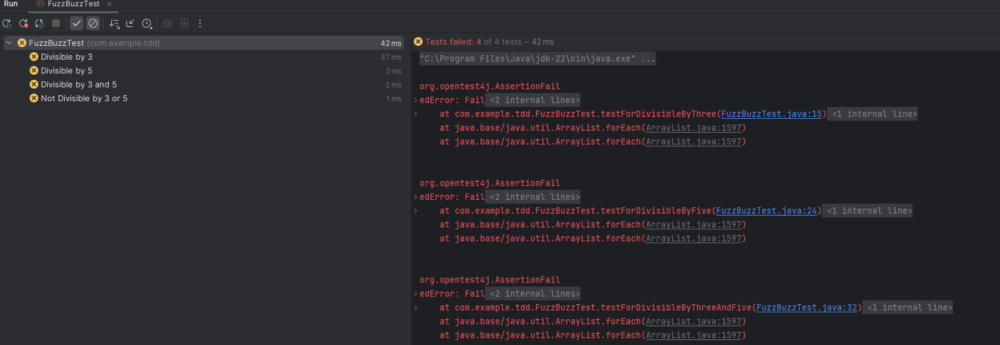

The very first step in TDD is to write failing test cases.

So, before we start with actual logic, let's start with tests. We will create a new package under our "test -> java" folder named "com.example.tdd" for our test class that contains our test cases.

We will have the same package under the "main -> java" folder as well.

As for the name of the Java Class for tests, we can name it "FizzBuzzTest".

    public class FuzzBuzzTest {
    
        // If the number is divisible by 3, print Fizz

        // If the number is divisible by 5, print Fizz

        // If the number is divisible by 3 and 5, print FizzBuzz

        // If the number is not divisible by 3 or 5, print the number
    
    }

So, this is our test class where we will write tests for all the four cases.

And now, since we want all these to be failing test cases, we can simply use the "fail" method from the "Assertions" class - 

    @TestMethodOrder(MethodOrderer.OrderAnnotation.class)
    public class FuzzBuzzTest {

        // If the number is divisible by 3, print Fizz
        @Test
        @DisplayName("Divisible by 3")
        @Order(1)
        void testForDivisibleByThree() {
            fail("Fail");
        }

        // If the number is divisible by 5, print Fizz

        @Test
        @DisplayName("Divisible by 5")
        @Order(2)
        void testForDivisibleByFive() {
            fail("Fail");
        }

        // If the number is divisible by 3 and 5, print FizzBuzz
        @Test
        @DisplayName("Divisible by 3 and 5")
        @Order(3)
        void testForDivisibleByThreeAndFive() {
            fail("Fail");
        }

        // If the number is not divisible by 3 or 5, print the number
        @Test
        @DisplayName("Not Divisible by 3 or 5")
        @Order(4)
        void testForNotDivisibleByThreeOrFive() {
            fail("Fail");
        }
    }

Note that we are defining the order of all the test methods. We just want them to execute in the same order as we have defined the conditions. And we are also setting custom display names.

Now, if we run this test class, ofcourse all the four tests will fail. This is the first step in TDD.