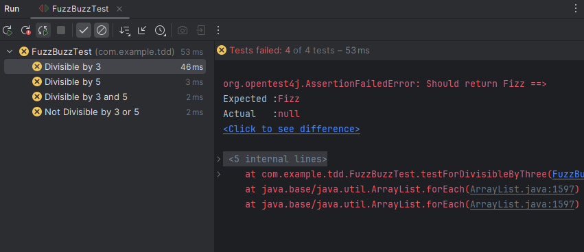
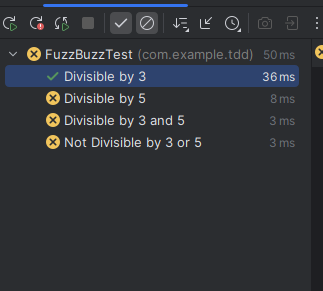
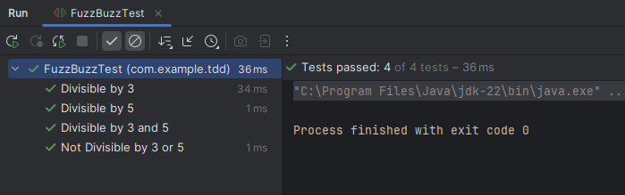

The next step is to write some code so that the tests pass.

First, we write the test for the first test method - testForDivisibleByThree() -

    @Test
    @DisplayName("Divisible by 3")
    @Order(1)
    void testForDivisibleByThree() {
        String expected = "Fizz";
        
        assertEquals(expected, FizBuzz.compute(3), "Should return Fizz");
    }

You might argue, but we do not have any "FizzBuzz" class created yet so how to use this "compute" method on it? Well, that's true. We have to drive our development process based on the tests that's why we are first writing the tests and then we will write the actual code.

So now, we should add a new class to our project named "FizzBuzz" that has a compute method.

So, we create a new class "FizBuzz" in the com.example.tdd package that we have in main -> java. Note that since the package names are the same for our "FizzBuzz" class and the "FizzBuzzTest" class, we don't need to import anything in "FizzBuzzTest". You don't need an import statement for classes in the same package. They are available by their short name.

Next step is to create a method named "compute" in this class that returns a "String" and takes an "int".

    public class FizBuzz {
        public static String compute(int i) {
            return null;
        }
    }

Now if we run our test class, all the tests will still fail, including the one we just wrote because we are still returning "null" instead of the expected data.

So, let's write some code that fixes this failing test -    

    public static String compute(int i) {

        if (i % 3 == 0) {
            return "Fizz";
        }

        return null;
    }

And now, we have our first test showing as passed!

Now, we can do the same with the second test which is to test divisible by "5" - 

    @Test
    @DisplayName("Divisible by 5")
    @Order(2)
    void testForDivisibleByFive() {
        String expected = "Buzz";
        assertEquals(expected, FizBuzz.compute(5), "Should return Fizz");
    }

And since it will still fail, we need to update the "compute" method and write the code that will make this test pass - 

    public static String compute(int i) {

        if (i % 3 == 0) {
            return "Fizz";
        } else if (i % 5 == 0) {
            return "Buzz";
        }

        return null;
    }

Cool. Now we have two passing tests and two failing ones.

Now, let's move on to the next one, the test for divisible by 3 and 5. So, our test will be like this - 

    @Test
    @DisplayName("Divisible by 3 and 5")
    @Order(3)
    void testForDivisibleByThreeAndFive() {
        String expected = "FizzBuzz";
        assertEquals(expected, FizBuzz.compute(15), "Should return FuzzBuzz");
    }

And it fails.

Huh.. So, let's try adding an else if that covers it right?

    public static String compute(int i) {

        if (i % 3 == 0) {
            return "Fizz";
        } else if (i % 5 == 0) {
            return "Buzz";
        } else if (i % 3 == 0 && i % 5 == 0) {
            return "FizzBuzz";
        }

        return null;
    }

But still, the test will fail as "Fizz" is now being printed instead of "FizzBuzz". It means, our first "if" check if true and that's why it is returning "Fizz". But, obviously if some number if divisible by 3, it may also be divisible by 5. So, it means we want our third check to be at the beginning.

    public static String compute(int i) {
    
        if (i % 3 == 0 && i % 5 == 0) {
            return "FizzBuzz";
        } else if (i % 3 == 0) {
            return "Fizz";
        } else if (i % 5 == 0) {
            return "Buzz";
        }

        return null;
    }

And now, all three of our tests will pass.

Finally, its time for the last test where if the number of not divisible by 3 or 5, we simply return the number itself - 

    @Test
    @DisplayName("Not Divisible by 3 or 5")
    @Order(4)
    void testForNotDivisibleByThreeOrFive() {
        int expected = 11;
        assertEquals(expected, FizBuzz.compute(11), "Should return 11");
    }

It will fail saying that the value received was "null" even though "11" was expected. That's because for "11", compute method returns "null" since none of the conditions are not matched.

So, to make it pass, we simply return the number (as string) itself instead of null at the end.

    public static String compute(int i) {

        if (i % 3 == 0 && i % 5 == 0) {
            return "FizzBuzz";
        } else if (i % 3 == 0) {
            return "Fizz";
        } else if (i % 5 == 0) {
            return "Buzz";
        }

        return return Integer.toString(i);;
    }

And now, we have all our test passing!

And so, we are done with our coding step.