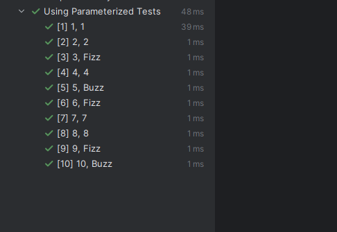
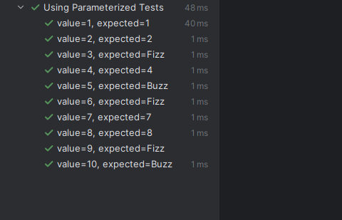
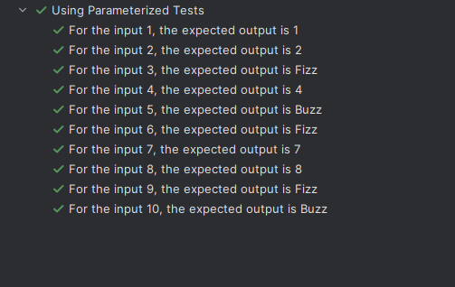
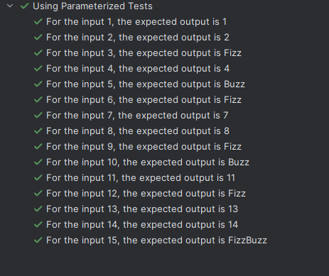

MOTE - BEFORE STARTING, MAKE SURE YOU ADD THIS DEPENDENCY IN POM.XML FILE - 

    <dependency>
        <groupId>org.junit.jupiter</groupId>
        <artifactId>junit-jupiter-params</artifactId>
        <version>5.11.0</version>
        <scope>test</scope>
    </dependency>

The reason is, in order to use JUnit 5 parameterized tests, we need to import the junit-jupiter-params artifact from JUnit Platform.

------------------------------------

At the moment, we have hardcoded values in our tests based on which we write our tests. But, this does not mean that all our test cases are covering every single input.

We should have dynamic inputs in our tests so that we ensure that almost every possible type of input value can be tested.

Maybe we can write a test that has a list of values and for each value, we also have the expected output. Then, we can loop over that list and simply check every value, pass it to the compute() method and then compare the returned value with the expected value.

Something like this - 

    @Test
    @DisplayName("Loop over array")
    @Order(5)
    void testLoopOverArray() {
        String[][] data = {
                {"1", "1"},
                {"2", "2"},
                {"3", "Fizz"},
                {"4", "4"},
                {"5", "Buzz"},
                {"6", "Fizz"},
                {"7", "7"},
                {"8", "8"},
                {"9", "Fizz"},
                {"10", "Buzz"}
        };
        
        Arrays.stream(data).forEach(val -> 
            assertEquals(val[1], FizBuzz.compute(Integer.parseInt(val[0])), "Should return 11")
        );
        
    }

And this will pass.

But, this is something we can do quickly as JUnit provides us one feature for this.

JUnit has something called @ParameterizedTest which can run a test multiple times and provide different parameter values each time.

All we need to do is provide all the data and behind the scenes, JUnit will run all the tests multiple times and supply the data. In other words, JUnit will do all the looping stuff for us.

# PASSING DATA USING ANNOTATIONS

When we use @ParameterizedTest annotation, there are different ways in which we can pass the data -

    - @ValueSource -> We can pass an array of Strings, ints, doubles, floats etc.
    - @CsvSource -> Array of CSV String values (Comma-Separated Values)
    - @CsvFileSource -> CSV Values read from a file  (Comma-Separated Values)
    - @EnumSource -> Enum constant values
    - @MethodCourse -> Provide our custom method for providing values
    - @NullSource -> Provide a single null value to a parameterized test method.
    - @EmptySource -> Provide an empty value. For String arguments, the passed value would be as simple as an empty String. Moreover, this parameter source can provide empty values for Collection types and arrays.
    - @NullAndEmptySource -> Provide both null and empty values
  
So, let's take an example of @CsvSource where we acn provide a comma separate values.

    @ParameterizedTest
    @DisplayName("Using Parameterized Tests")
    @CsvSource({"1,1", "2,2", "3,Fizz", "4,4", "5,Buzz", "6,Fizz", "7,7", "8,8", "9,Fizz", "10,Buzz"})
    @Order(6)
    void testParameterized(int value, String expected) {
        assertEquals(expected, FizBuzz.compute(value), "Should return "+ expected);
    }

So, when we run our test class now, it will show the parameterized test in the test results and all the individual values that it tested based on the data that we provided.

# CUSTOM INVOCATION NAMES

We can also give custom invocation names inside @ParameterizedTest annotation.

    @ParameterizedTest(name = "value={0}, expected={1}")

This means that "value" is at index 0 and "expected" is at index "1".

Now, if we run our test, then you will see in the terminal that it will also print the value and expected.

For example, let's say - 

    @ParameterizedTest(name = "For the input {0}, the expected output is {1}")

Now it shows a nice text for each individual test from which anyone can easily understand what is going on.

# READING A CSV FILE

What if we want to read the input data from some csv file? Well, we can do that as well.

Let's have a "csv" file under the test/resources folder named "test-data.csv".

In this file, we can write the comma separated values - 

    1,1
    2,2
    3,Fizz
    4,4
    5,Buzz
    6,Fizz
    7,7
    8,8
    9,Fizz
    10,Buzz
    11,11
    12,Fizz
    13,13
    14,14
    15,FizzBuzz

Now, all we need to do is use the @CsvFileSource annotation to reference this file - 
    
    @CsvFileSource(resources = "/test-data.csv")
    @Order(6)
    void testParameterized(int value, String expected) {
        assertEquals(expected, FizBuzz.compute(value), "Should return "+ expected);
    }

And there we have it!

Here is a nice guide for parameterized tests in JUnit 5 -> https://www.baeldung.com/parameterized-tests-junit-5