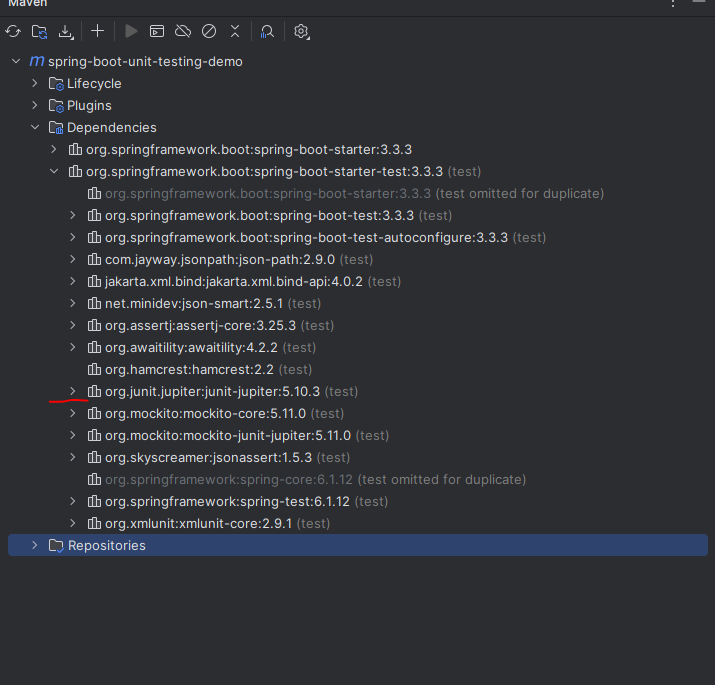
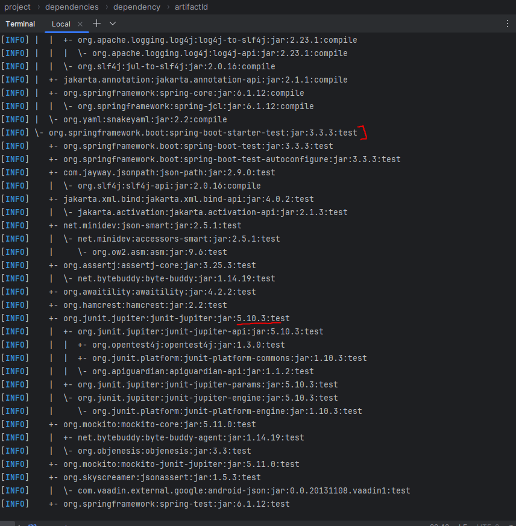

It is a super simple project where we have a "CollegeStudent" class, a "Student" interface" and a "StudentGrades" class. All the logic to calculate grades is present in this "StudentGrades" class.

In our main class, we have manually defined the bean for the CollegeStudent class - 

    public class MvcTestingExampleApplication {

	public static void main(String[] args) {
		SpringApplication.run(MvcTestingExampleApplication.class, args);
	}

	@Bean(name = "collegeStudent")
	@Scope(value = "prototype")
	CollegeStudent getCollegeStudent() {
		return new CollegeStudent();
	}

}

We also have some properties in the application.properties file.

So, the very first step is to add the Maven Dependency for "spring-boot-starter-test".

    <dependency>
		<groupId>org.springframework.boot</groupId>
		<artifactId>spring-boot-starter-test</artifactId>
		<scope>test</scope>
	</dependency>

Note that here, the scope is "test" because we do not want this dependency for the actual application. We just want it for testing purpose.

As we discussed previously, the "spring-boot-starter-test" includes a transitive dependency on JUnit 5 and we can confirm that in our IDE if you expand the dependency.

There is also another way to see this dependency tree using "mvn" command in the terminal. So, you just need to write -

    mvn dependency:tree

This command will show you the dependency tree in your terminal.

And well, we are now all set to write our tests!