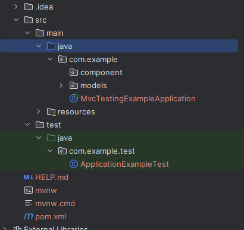

So, let's create a new "test" folder in our "src" folder since initially, we only have a "main" folder. 

And then, we create a package and then in that package we create a class for our tests. Let's call it "ApplicationExampleTest.java".

Now, we can add the @SpringBootAnnotation to our test class.

    @SpringBootTest
    public class ApplicationExampleTest {
    }

And just to see if everything works, let's add a dummy test method and run this class.

    @Test
    void basicTest() {  
        assertEquals(1, 1);
    }

Now, if we run this class, our test will pass. This means the setup so far is all good.

# READING APPLICATION PROPERTIES & INJECTING DEPENDENCIES

Under the src/main/resources, we have some properties in the application.properties file - 

    info.school.name=luv2code
    info.app.name=My Super Cool Gradebook
    info.app.description=a fun way to track student grades!
    info.app.version=1.0.0

So, let's try to access them using the @Value annotaton in our test class - 

    @SpringBootTest
    public class ApplicationExampleTest {

        @Value("${info.app.name}")
        private String appName;

        @Value("${info.school.name}")
        private String schoolName;

        @Value("${info.app.description}")
        private String appDescription;

        @Value("${info.app.version}")
        private String appVersion;

        @Test
        void basicTest() {
            assertEquals(1, 1);
        }
    }

Similarly, let's try to inject some beans - CollegeStudent and StudentGrades.

    @Autowired
    StudentGrades studentGrades;
    
    @Autowired
    CollegeStudent collegeStudent;

Then, as we have done earlier, we can write a @BeforeEach method that will run before each test.

    @BeforeEach
    public void beforeEach() {
        count += 1;
        System.out.println("Testing: " + appName + " which is " + appDescription + " Version: " + appVersion + ". Execution of test method " + count);
        collegeStudent.setFirstname("Eric");
        collegeStudent.setLastname("Roby");
        collegeStudent.setEmailAddress("eric.roby@gmail.com");

        studentGrades.setMathGradeResults(new ArrayList<>(Arrays.asList(100.0, 85.0, 76.50, 91.75)));
        collegeStudent.setStudentGrades(studentGrades);
    }

So, all that we are doing is incrementing one counter variable, printing the value of application.properties, and then initializing the StudentGrades and CollegeStudent objects.

Now, let's see the output in the terminal when we run the file.

And well, everything is workign fine! It is fetching the properties from the application.properties file.

# ASSERTIONS

Let's add a new test for adding a grade result for student grades - 

    @Test
    @DisplayName("Equals test for addGradeResultsForSingleClass() method")
    void addGradeResultsForStudentGrades() {

        double expected = 353.25f;

        double result = studentGrades.addGradeResultsForSingleClass(collegeStudent.getStudentGrades().getMathGradeResults());

        assertEquals(expected, result);
    }

So, nothing special here at all. This is everything we have already learned before.

Similarly, we can write a NotEquals test - 

    @Test
    @DisplayName("Not Equals test for addGradeResultsForSingleClass() method")
    void addGradeResultsForStudentGradesNotEquals() {

        double expected = 0;

        double result = studentGrades.addGradeResultsForSingleClass(collegeStudent.getStudentGrades().getMathGradeResults());

        assertNotEquals(expected, result);
    }

And our tests are all passing!

Let's test the "isGradeGreater" method that returns True or False - 

    @Test
    @DisplayName("True test for isGradeGreater() method")
    void isGradeGreaterStudentGradesTrueTest() {
        boolean result = studentGrades.isGradeGreater(90, 75);
        assertTrue(result, "Failure - should be true");
    }

    @Test
    @DisplayName("False test for isGradeGreater() method")
    void isGradeGreaterStudentGradesFalseTest() {
        boolean result = studentGrades.isGradeGreater(75, 90);
        assertFalse(result, "Failure - should be false");
    }

Finally, we can end with writing a test to check Null values - 

    @Test
    @DisplayName("Check Null for Student Grades")
    void checkNullForStudentGrades() {
        
        Object res = studentGrades.checkNull(collegeStudent.getStudentGrades().getMathGradeResults());

        assertNotNull(res);
    }

# PROTOTYPE BEANS

So far, we have tested the methods of the "StudentGrades" class which is a singleton bean because by default, all beans are singleton.

But, as we have written in our Main Class - 

    @Bean(name = "collegeStudent")
	@Scope(value = "prototype")
	CollegeStudent getCollegeStudent() {
		return new CollegeStudent();
	}

The "CollegeStudent" class is not a singleton. It is a prototype bean which means different instances of this class will be provided each time we ask for them.

So, let's use our "ApplicationContext" here. We can inject a dependency of ApplicationContext like this - 

    @Autowired
    ApplicationContext context;

And then, we can write a test and get a new "CollegeStudent" instance using the getBean() method. Note that if the bean was not prototype, this method would've returned us the same instance that is already present in Spring IOC Container.

    @Test
    @DisplayName("Create student without grade init")
    void createStudentWithoutGradesInit() {

        CollegeStudent studentTwo = context.getBean("collegeStudent", CollegeStudent.class);
        studentTwo.setFirstname("John");
        studentTwo.setLastname("Doe");
        studentTwo.setEmailAddress("john.doe@gmail.com");

        assertNotNull(studentTwo.getFirstname());
        assertNotNull(studentTwo.getLastname());
        assertNotNull(studentTwo.getEmailAddress());

        assertNull(studentGrades.checkNull(studentTwo.getStudentGrades()));
    }

Note that we had set the grades of the first student instance that we injected using @Autowird in the @BeforeEach. But those are not used here because this is a different student instance. That's why the last assertNull statement is running properly.

Just to prove it, let's change the bean from prototype to singleton - 

    @Bean(name = "collegeStudent")
	@Scope(value = "singleton")
	CollegeStudent getCollegeStudent() {
		return new CollegeStudent();
	}

And now, we see that the test does not pass.

The terminal says that while we tried to assert that the grades are null, they are not. And that's because now, both the "CollegeStudent" beans refer to the same object since we have made the bean singleton. And since we are setting the grades in @BeforeEach, they are also present for the "studentTwo".

So, that's the whole idea behind prototype and singleton beans.

We can even use the "assertNotSame" assertions to test that both student objects are different - 

    assertNotSame(collegeStudent, studentTwo);

# ASSERT ALL

There is something we have not done before. That's having multiple asserts as part of a single assert statement. 

For that, we can use "assertAll" method. We can pass it lambda expressions as arguments where reach lambda expression has an assertion.

Let's try that to test the "findGradePointAverage" method in "StudentGrades" class - 

    @Test
    @DisplayName("Find Grade Point Average")
    void findGradePointAverage() {

        assertAll("Testing all assertEquals",

                () -> assertEquals(353.25, studentGrades.addGradeResultsForSingleClass(collegeStudent.getStudentGrades().getMathGradeResults())),

                () -> assertEquals(88.31, studentGrades.findGradePointAverage(collegeStudent.getStudentGrades().getMathGradeResults()))
        );
    }

So, that's it! That's how we can have multiple assertions in one assert method.

Now, you might think, why not just write multiple assertions one after other as we did previously?

The interesting thing about "assertAll" is that it always checks all of the assertions that are passed to it, no matter how many fail. If all pass, all is fine - if at least one fails you get a detailed result of all that went wrong (and right for that matter).

If we have multiple assertions one after the other, then if one fails, the whol test fails and hence the remaining assertions are not validated. You may want to run all the asserts even if one fails to see the result of all the others. And that's where "assertAll" comes into the picture.
