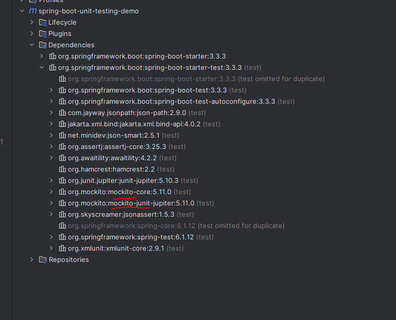

In a Traditional Spring Boot application, we have a structure like this - 

    Main App <-> Service <-> DAO <-> Database

Now, let's say we want to test the "Service". And we want a minimal configuration of the dependencies like DAO or Database.

But, currently, the "DAO" communicates with an actual database. And since we are talking about Unit Testing here, testing with a database is not unit testing. Instead, it is something called as "Integration" testing.

So, when we are writing unit tests for our Service, we should not care about the communication of the DAO layer with the database. We should only test the functionality of the Service layer.

Now comes the concept of Mocking.

Why not use a test double instead of a real DAO? Maybe we can configure this test double such that we tell it if you get this input, return us this output. We do not want you to go and connect to an actual database.

And that's called Mocking!

We can use a mocking framework if we want to create mock objects and one such framework is the "Mockito" framework.

The benefits of mocking - 

    - Allows us to test a given class in isolation
    - Test interaction between given class and its dependencies
    - Minimizes the configuration / availability of dependencies

"Mockito" is not the only mocking framework for Java. In fact, we have many more frameworks like "EasyMock", "JMockit" etc.

We will be using "Mockito" because Spring Boot has built-in support for "Mockito".

And you can understand that if you see the dependency tree of the "spring-boot-starter-test" dependency.

When we unit test with Mocks, then we have this structure - 

    SETUP -> EXECUTE -> ASSERT -> VERIFY

In the "SETUP" step we set the expectations with the mock responses.

In the "EXECUTE" step, we call the method that we want to test.

In the "ASSERT" step, we check if the result and the expected result are the same.

The "VERIFY" step is optional where we can verify the calls to the method. For example, how many times the method was called etc.