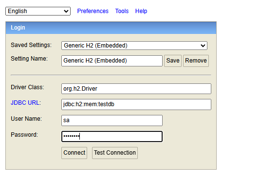
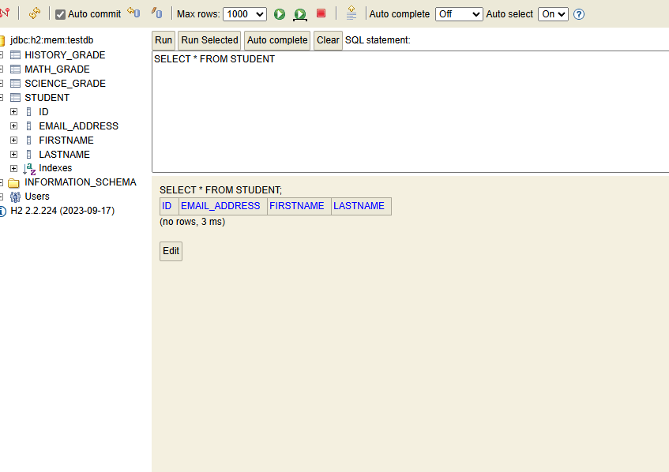

Now, let's write a test that will test if the student with id "1" exists in the database or not.

    @Test
    public void isStudentNullCheck() {
        assertTrue(studentService.checkIfStudentExists(1));
        assertFalse(studentService.checkIfStudentExists(0));
    }

Now, at this point, we do not have a method in our service that is named "checkIfStudentExists" so we will create that.

    @Override
    public boolean checkIfStudentExists(int id) {
        Optional<CollegeStudent> student = studentRepository.findById(id);
        return student.isPresent();
    }

And now, we see that the test will pass. That's because in the @BeforeEach, we are creating and saving a new student in the database and since the id is auto generated and it starts with "1", so the id of this newly added student will be "1". So, if we search a student with id 1, we will get a valid student hence "assertTrue" will be true for "checkIfStudentExists(1)". But there is no student with id as "0" so "checkIfStudentExists(0)" will return us False.

# TEST DELETION OF DATA FROM TEH DATABASE

Let's write another test, this time to test deletion of a student.

    @Test
    public void deleteStudentTest() {
        assertTrue(studentService.checkIfStudentExists(1), "Student with id 1 should exist in the database");

        studentService.deleteStudent(1);

        assertFalse(studentService.checkIfStudentExists(1), "Student with id 1 should no longer exist in the database");
    }

And again, we need to add a method "deleteStudent" in our service.

    @Override
    public void deleteStudent(int id) {
        if (checkIfStudentExists(id)) {
            this.studentRepository.deleteById(id);
        }
    }

# REVIEWING APPLICATION PROPERTIES

We have some "H2" related properties in our application.properties file that are commented out initially - 

    #spring.datasource.url=jdbc:h2:mem:testdb
    #spring.datasource.driverClassName=org.h2.Driver
    #spring.datasource.username=sa
    #spring.datasource.password=password
    #spring.datasource.initialization-mode=always
    #spring.jpa.database-platform=org.hibernate.dialect.H2Dialect
    #spring.h2.console.enabled=true
    #spring.jpa.hibernate.ddl-auto=create-drop
    #spring.jpa.show-sql = true

What are all these?

Let's uncomment them and know what all they do. The first four are something we already know - 

    spring.datasource.url=jdbc:h2:mem:testdb
    spring.datasource.driverClassName=org.h2.Driver
    spring.datasource.username=sa
    spring.datasource.password=password

They are just to set up the database with username, password, driver and URL.

Next up, we have a property named - 

    spring.datasource.initialization-mode=always

This property will automatically create the database schema regardless of the DataSource type.

Next, we have - 

    spring.jpa.database-platform=org.hibernate.dialect.H2Dialect

As we know, SQL databases like Oracle, MySQL etc have some differences here and there so with this property, we are saying use the "H2" Dialect because we are using the H2 database.

    spring.h2.console.enabled=true

This will enable the web console of the H2 database for our project.

Then we have this - 

    spring.jpa.hibernate.ddl-auto=create-drop

This will drop the existing tables and create new tables. After the operations are done, it drops the database schema. And this is commonly used for Integration testing.

    spring.jpa.show-sql = true

This will show all the SQL statements in the logs.

Once you uncomment all and run your spring app, you can actually go to -

    localhost:1500/h2-console

And this will open a new page where you can enter the password and the database url (same url as the application.properties file) and connect.

And now, you will see a whole console on your screen with all the tables.

Moreover, if you run your test class, you will also see the actual SQL statements that are executed by JPA / Hibernate in the terminal.

# TESTING COUNT OF STUDENTS IN TABLE

Let's write a test that fetches all the students in the table -

    @Test
    public void getGradebookService() {
        Iterable<CollegeStudent> iterableCollegeStudent = studentService.getGradebook();

        List<CollegeStudent> studentList = new ArrayList<>();

        iterableCollegeStudent.forEach(studentList::add);

        assertEquals(1, studentList.size(), "Only one student should be present in the database table");

    }

Again, we will have to define a new method named "getGradebook" - 

    @Override
    public Iterable<CollegeStudent> getGradebook() {
        return studentRepository.findAll();
    }

And this will also pass because we have only one student for each test as we only add one student before each test and we delete all the rows when test is complete.