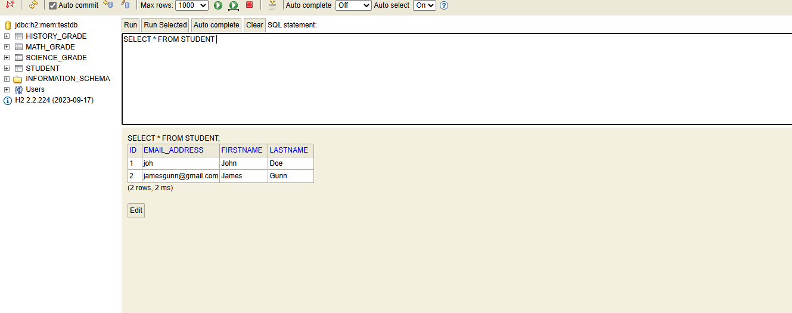

So far, we have written tests and also the code in the controller. But, our UI or the view is still the old one where we had hardcoded content instead of reading it from the service.

So, we first have to update the index.html file to have the form submit the data to the "GradebookController".

Then, we will also need to update the index.html to display a list of students using a for loop to loop over the "students" model attribute.

One thing we will do is in our controller, when we create a new student, we will pass the list of college students (that also includes this new student) to the Model, just how we did in case of get mapping.

    @PostMapping("/")
	public String createStudent(@ModelAttribute("student") CollegeStudent student, Model m) {

		studentAndGradeService.createStudent(student.getFirstname(), student.getLastname(), student.getEmailAddress());

		Iterable<CollegeStudent> collegeStudentIterable = this.studentAndGradeService.getGradebook();
		m.addAttribute("students", collegeStudentIterable);

		return "index";
	}

And now, we just go in the index.html file and uncomment the code that dynamically iterates over the list of students that we get from the service and displays them.

And now, when you restart the application, you can now insert data into the table shown in the UI by entering the first name, last name and email address in the input boxes and hitting submit.

And to verify that all this is indeed being saved in a database, you can go to the H2 console and see the table entries. You will find the data that you have added in that table.

